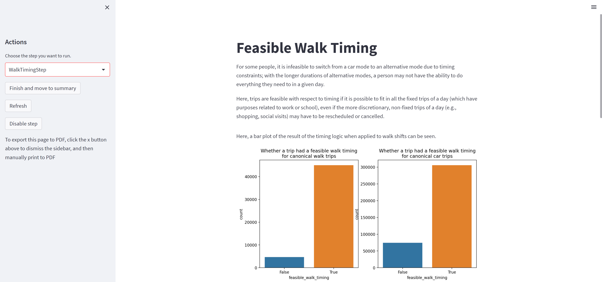
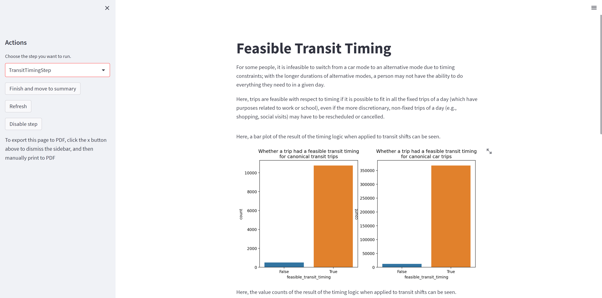
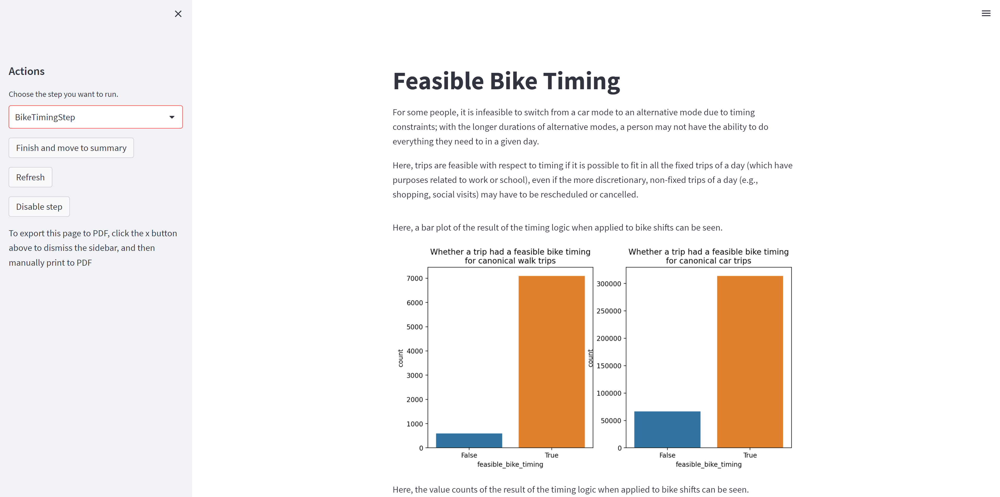

```{python}
#| include: false
import keyring
import os
import pandas as pd
import numpy as np
from IPython.display import display, Markdown

data_dir = keyring.get_password("msp", "vmt_reduction_dir")

tbi = pd.read_csv(os.path.join(data_dir, "Data_Processed", "tbi_cleaned.csv"), low_memory=False)
```

# Introduction

- Travel models try to predict the future based on the past
- Climate change, roadway safety, and others factors suggest the need for _non-marginal_ changes in travel behavior
- Instead of asking what is probable, we want to ask what is possible?

# Introduction

- The Twin Cities region has made significant investment in transit and ped/bike infrastructure
- Based on observed travel patterns, how many car trips could be shifted to other modes given this existing infrastructure

# Data

```{python}
display(Markdown(f"""
- 2019 and 2021 Travel Behavior Inventory travel survey
- {len(tbi):,} linked trips
    - {np.average(tbi["mode"] == "Car", weights=tbi.day_weight) * 100:.0f}% by car
    <!-- TODO confirm units are miles -->
    - {np.average(tbi.distance <= 3, weights=tbi.day_weight) * 100:.0f}% less than 3 miles
"""))
```

# Data

- OpenStreetMap street network data for south-central Minnesota and western Wisconsin
- Metro Transit GTFS data from 2019
- StreetLight congestion data

# Project outline

- Construct "counterfactual" trips by each mode using routing software
- Compare those trips to the observed car trips
- Determine which trips could feasibly have been taken using a different mode

# Routing

- Open source tools
    - Open Source Routing Machine software for on-street routing
    - TransitRouter.jl for transit routing

# Routing "profiles"

- Four modes
  - Walking
  - Bicycling
  - Transit
  - Car
- For behavioral realism, include factors other than time

# Walking profile

- Base walking speed 4.9 km/h (3 mph, 1.35 m/s)
- Four classes of pedestrian environment quality based on roadway functional class and OpenStreetMap tags
  - Developed by Virginia DOT [@hardy_accessibility_2019]
  - 11% penalty for "Medium" quality
  - 25% penalty for "Low" quality
  - 100% penalty for "Available" quality
  - Penalties applied to weighting, do not directly affect travel time
- Future work: penalty for slopes over 10%

# Bicycling profile

- Base bicycling speed 19 km/h (12 mph)
- Level of Traffic Stress used for weighting routes
  - Based on Accessibility Observatory methodology [@murphy_implementing_2019]
  - LTS 2: 10% penalty, for both travel time and weight
  - LTS 3/4: assume cyclists will dismount, use walking profile
- Intersection penalties based on LTS of all roads at that intersection

# Driving profile

- OSRM default driving profile
- Speeds adjusted using StreetLight congestion data for time period when trip occurred

# Transit profile

- We use the same walk profile for access, egress, and transfers
<!-- - Maximum access, egress, or transfer distance is 2.4 km (1.5 mi) <!-- TODO I think the transfer distance is 2.5 km, oops -->
- Transit pathfinding based on time and number of transfers

# Routing statistics

- Street: 8m
- Transit: 2h 45m
- 24-core, 128GB RAM, Windows Subsystem for Linux

# Defining a feasible shift

- We created a web-based tool to evaluate the feasibility of mode shift
- Tool walks users through a series of steps to define assumptions about the process
- After each step, tools displays current mode shift potential

# Walking distance


# Walking distance


# Walking distance


::: {.vmtprogress}

|             | Walk  | Bike | Transit |
|-------------|-------|------|---------|
| % of trips  | 24.8 | --    | --      |
| % of VMT    |  3.5 | --    |         |

:::

# Biking distance


::: {.vmtprogress}

|             | Walk  | Bike | Transit |
|-------------|-------|------|---------|
| % of trips  | 24.8 | 72.4  | --      |
| % of VMT    |  3.5 | 31.7    |         |

:::

# Biking distance


::: {.vmtprogress}

|             | Walk  | Bike | Transit |
|-------------|-------|------|---------|
| % of trips  | 24.8 | 72.4  | --      |
| % of VMT    |  3.5 | 31.7    |         |

:::

# Biking distance


::: {.vmtprogress}

|             | Walk  | Bike | Transit |
|-------------|-------|------|---------|
| % of trips  | 24.8 | 72.4  | --      |
| % of VMT    |  3.5 | 31.7    |         |

:::

# Biking distance


::: {.vmtprogress}

|             | Walk  | Bike | Transit |
|-------------|-------|------|---------|
| % of trips  | 24.8 | 72.4  | --      |
| % of VMT    |  3.5 | 31.7    |         |

:::

# Transit


::: {.vmtprogress}

|             | Walk  | Bike | Transit |
|-------------|-------|------|---------|
| % of trips  | 24.8 | 72.4  | 38.0      |
| % of VMT    |  3.5 | 31.7    |     25.4    |

:::

# Transit


::: {.vmtprogress}

|             | Walk  | Bike | Transit |
|-------------|-------|------|---------|
| % of trips  | 24.8 | 72.4  | 38.0      |
| % of VMT    |  3.5 | 31.7    |     25.4    |

:::

# Biking in the snow


::: {.vmtprogress}

|             | Walk  | Bike | Transit |
|-------------|-------|------|---------|
| % of trips  | 24.8 | 72.4  | 38.0      |
| % of VMT    |  3.5 | 31.7    |     25.4    |

:::

# Biking in the snow


::: {.vmtprogress}

|             | Walk  | Bike | Transit |
|-------------|-------|------|---------|
| % of trips  | 24.8 | 54.0  | 38.0      |
| % of VMT    |  3.5 | 23.9    |     25.4    |

:::

# People really don't like biking in the snow


# Level of Traffic Stress


::: {.vmtprogress}

|             | Walk  | Bike | Transit |
|-------------|-------|------|---------|
| % of trips  | 24.8 | 46.4  | 38.0      |
| % of VMT    |  3.5 | 22.2    |     25.4    |

:::

# Level of Traffic Stress


::: {.vmtprogress}

|             | Walk  | Bike | Transit |
|-------------|-------|------|---------|
| % of trips  | 24.8 | 46.4  | 38.0      |
| % of VMT    |  3.5 | 22.2    |     25.4    |

:::

# Timing

- For mode shift to occur, modes need to fit into people's day
- If alternatives are slower than driving, they may not fit between constraints
- Each mode has a "timing" step
- Can all mandatory trips be fit in given alternative travel times?

::: {.vmtprogress}

|             | Walk  | Bike | Transit |
|-------------|-------|------|---------|
| % of trips  | 24.8 | 46.4  | 38.0      |
| % of VMT    |  3.5 | 22.2    |     25.4    |

:::

# Walk timing



::: {.vmtprogress}

|             | Walk  | Bike | Transit |
|-------------|-------|------|---------|
| % of trips  | 19.9 | 46.4  | 38.0      |
| % of VMT    |  2.79 | 22.2    |     25.4    |

:::

# Walk timing


::: {.vmtprogress}

|             | Walk  | Bike | Transit |
|-------------|-------|------|---------|
| % of trips  | 19.9 | 46.4  | 38.0      |
| % of VMT    |  2.79 | 22.2    |     25.4    |

:::

# Transit timing



::: {.vmtprogress}

|             | Walk  | Bike | Transit |
|-------------|-------|------|---------|
| % of trips  | 19.9 | 46.4  | 38.0      |
| % of VMT    |  2.79 | 22.2    |     25.4    |

:::

# Transit timing


::: {.vmtprogress}

|             | Walk  | Bike | Transit |
|-------------|-------|------|---------|
| % of trips  | 19.9 | 46.4  | 34.8      |
| % of VMT    |  2.79 | 22.2    |     23.4    |

:::

# Bike timing



::: {.vmtprogress}

|             | Walk  | Bike | Transit |
|-------------|-------|------|---------|
| % of trips  | 19.9 | 38.7  | 38.0      |
| % of VMT    |  2.79 | 18.6    |     25.4    |

:::

# Bike timing


::: {.vmtprogress}

|             | Walk  | Bike | Transit |
|-------------|-------|------|---------|
| % of trips  | 19.9 | 38.7  | 34.8      |
| % of VMT    |  2.79 | 18.6    |     23.4    |

:::

# Results


::: {.vmtprogress}

|             | Walk  | Bike | Transit | Overall |
|-------------|-------|------|---------|---------|
| % of trips  | 19.9 | 38.7  | 34.8      | 60.1 |
| % of VMT    |  2.79 | 18.6    |     23.4    | 33.6 |

:::

# Results: where can trips shift?


# Results: who can shift trips?


# Results: who can shift trips?


# Results: who can shift trips?


# Conclusions

- There is significant mode shift potential in the Twin Cities
- That potential is concentrated in central areas
- Interactive visualizations can illuminate assumptions and sensitivity

# Questions/contact

Matt Bhagat-Conway<br/>
[mwbc@unc.edu](mailto:mwbc@unc.edu)

Greg Erhardt<br/>
[greg.erhardt@uky.edu](mailto:greg.erhardt@uky.edu)

# References