# Introduction

- Travel models try to predict the future based on the past
- Climate change, roadway safety, and others factors suggest the need for _non-marginal_ changes in travel behavior
- Instead of asking what is probable, we want to ask what is possible?

# Introduction

- The Twin Cities region has made significant investment in transit and ped/bike infrastructure
- Based on observed travel patterns, how many car trips could be shifted to other modes given this existing infrastructure

# Data

- 2019 and 2021 Travel Behavior Inventory travel survey
- 454,000 linked trips
  - 86% by car
    <!-- TODO confirm units are miles -->
    - 46% less than 3 miles

# Data

- OpenStreetMap street network data for south-central Minnesota and western Wisconsin
- Metro Transit GTFS data from 2019
- StreetLight congestion data

# Project outline

- Construct "counterfactual" trips by each mode using routing software
- Compare those trips to the observed car trips
- Determine which trips could feasibly have been taken using a different mode

# Routing

- Open source tools
    - Open Source Routing Machine software for on-street routing
    - TransitRouter.jl for transit routing

# Routing "profiles"

- Four modes
  - Walking
  - Bicycling
  - Transit
  - Car
- For behavioral realism, include factors other than time

# Walking profile

:::: {.columns}
::: {.column width="70%"}

- Base walking speed 4.9 km/h (3 mph, 1.35 m/s)
- Four classes of pedestrian environment quality based on roadway functional class and OpenStreetMap tags
  - Developed by Virginia DOT [@hardy_accessibility_2019]
  - 11% penalty for "Medium" quality
  - 25% penalty for "Low" quality
  - 100% penalty for "Available" quality
  - Penalties applied to weighting, do not directly affect travel time

:::
::: {.column width="25%"}
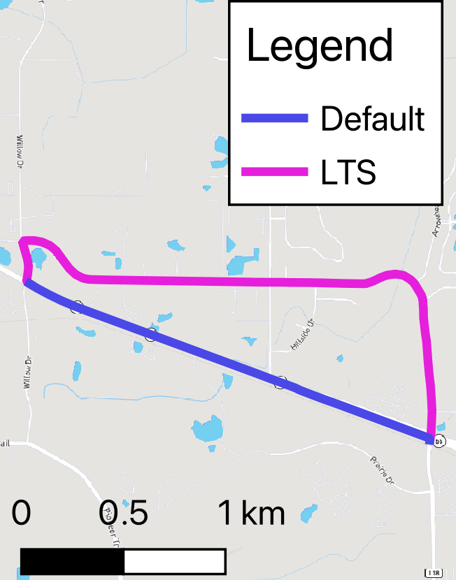
:::
::::

# Bicycling profile

:::: {.columns}
::: {.column width="70%"}

- Base bicycling speed 19 km/h (12 mph)
- Level of Traffic Stress used for weighting routes
  - Based on Accessibility Observatory methodology [@murphy_implementing_2019]
  - LTS 2: 10% penalty, for both travel time and weight
  - LTS 3/4: assume cyclists will dismount, use walking profile

:::
::: {.column width="25%"}

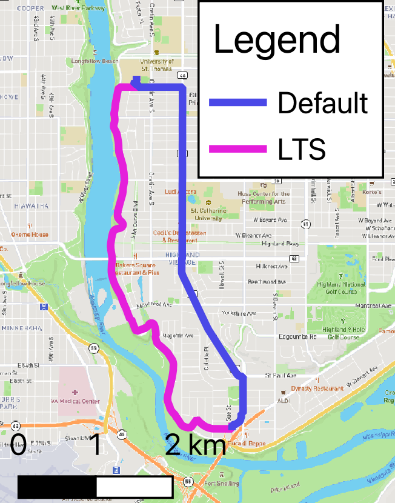
:::
::::

# Driving profile

- OSRM default driving profile
- Speeds adjusted using StreetLight congestion data for time period when trip occurred

# Transit profile

- We use the same walk profile for access, egress, and transfers
<!-- - Maximum access, egress, or transfer distance is 2.4 km (1.5 mi) <!-- TODO I think the transfer distance is 2.5 km, oops -->
- Transit pathfinding based on time and number of transfers

# Routing statistics

- Street: 8m
- Transit: 2h 45m
- 24-core, 128GB RAM, Windows Subsystem for Linux

# Defining a feasible shift

- We created a web-based tool to evaluate the feasibility of mode shift
- Tool walks users through a series of steps to define assumptions about the process
- After each step, tools displays current mode shift potential

# Walking distance

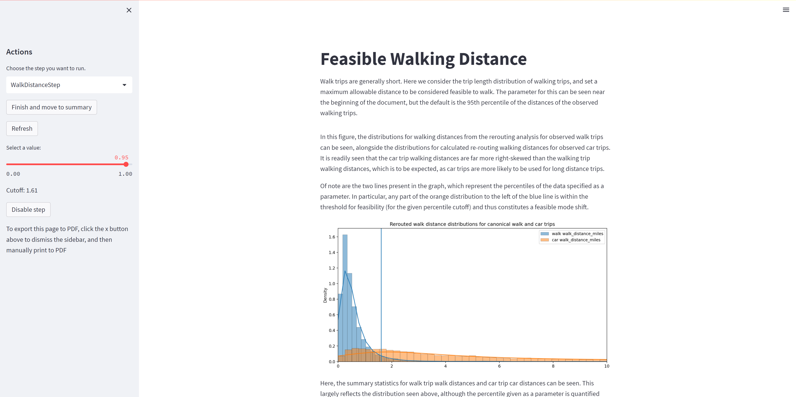

# Walking distance

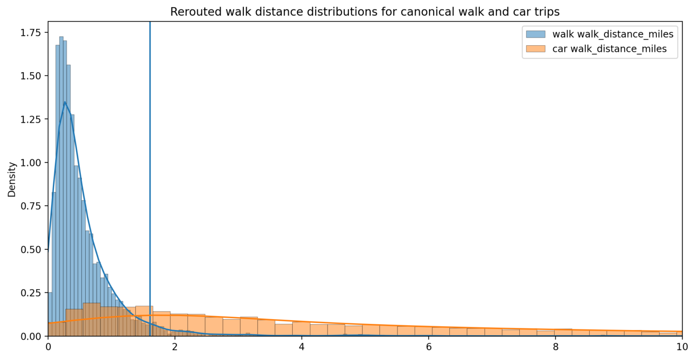

# Walking distance

::: {.vmtprogress}

|             | Walk  | Bike | Transit |
|-------------|-------|------|---------|
| % of trips  | 25 | --    | --      |
| % of VMT    |  3 | --    | --      |

:::

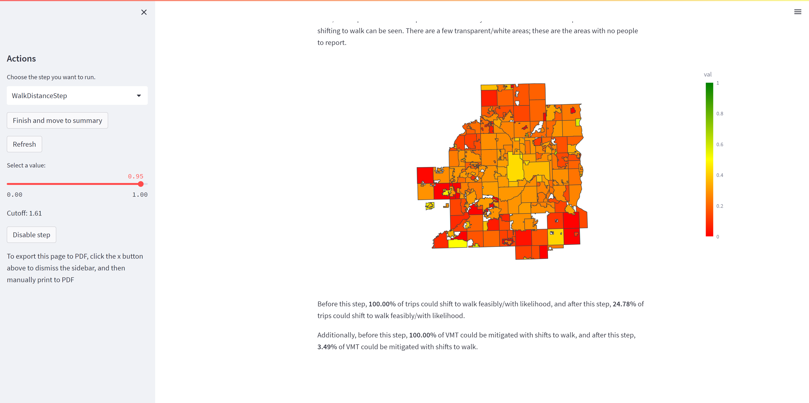

# Walking distance

::: {.vmtprogress}

|             | Walk  | Bike | Transit |
|-------------|-------|------|---------|
| % of trips  | 11 | --    | --      |
| % of VMT    |  1 | --    | --      |

:::

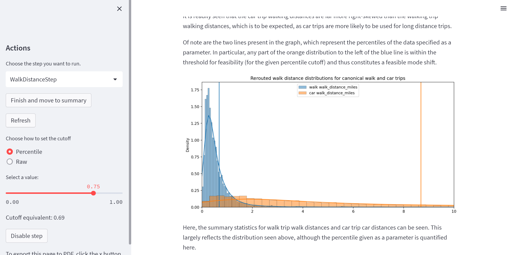

# Biking distance

::: {.vmtprogress}

|             | Walk  | Bike | Transit |
|-------------|-------|------|---------|
| % of trips  | 25 | 72  | --      |
| % of VMT    |  3 | 32    |    --     |

:::

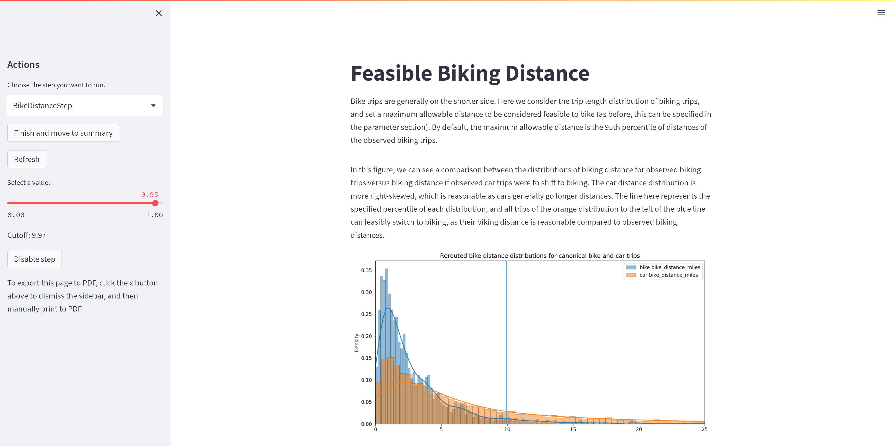

# Biking distance

::: {.vmtprogress}

|             | Walk  | Bike | Transit |
|-------------|-------|------|---------|
| % of trips  | 25    | 72    | --      |
| % of VMT    |  3    | 32    |   --      |

:::

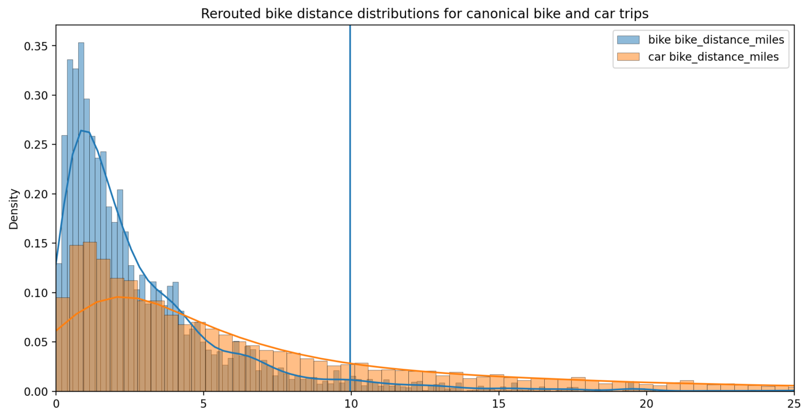

<!--# Biking distance

::: {.vmtprogress}

|             | Walk  | Bike | Transit |
|-------------|-------|------|---------|
| % of trips  | 25   | 72    | --      |
| % of VMT    |  3   | 32    |   --      |

:::

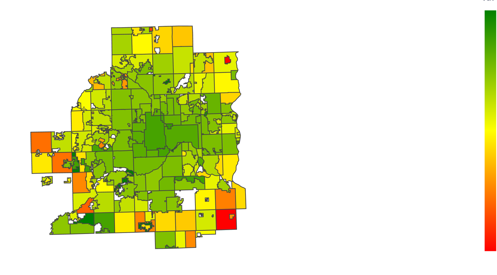-->

# Transit

::: {.vmtprogress}

|             | Walk  | Bike | Transit |
|-------------|-------|------|---------|
| % of trips  | 25    | 72    | 59     |
| % of VMT    |  3    | 32    |  46    |

:::

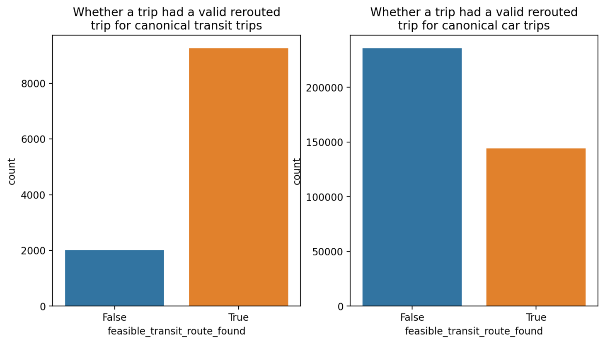

# Transit

::: {.vmtprogress}

|             | Walk  | Bike | Transit |
|-------------|-------|------|---------|
| % of trips  | 25    | 72    | 59     |
| % of VMT    |  3    | 32    |  46    |

:::

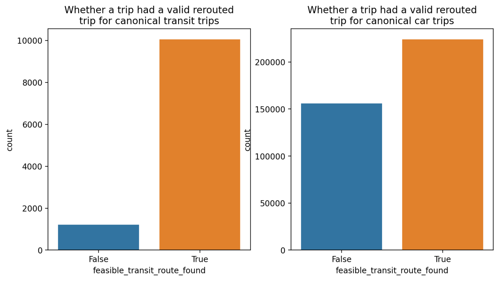
 
# Additional steps

::: {.vmtprogress}

|             | Walk  | Bike | Transit |
|-------------|-------|------|---------|
| % of trips  | 25    | 46    | 59     |
| % of VMT    |  3    | 22    |  46    |

:::

- Biking impractical for most in the snow
- Bike trips with a significant portion on busy streets

# Timing

::: {.vmtprogress}

|             | Walk  | Bike | Transit |
|-------------|-------|------|---------|
| % of trips  | 25    | 46    | 59     |
| % of VMT    |  3    | 22    |  46    |

:::

- For mode shift to occur, modes need to fit into people's day
- If alternatives are slower than driving, they may not fit between constraints
- Each mode has a "timing" step
- Can all mandatory trips be fit in given alternative travel times?

# Walk timing

::: {.vmtprogress}

|             | Walk  | Bike | Transit |
|-------------|-------|------|---------|
| % of trips  | 17    | 46    | 59     |
| % of VMT    |  2    | 22    |  46    |

:::

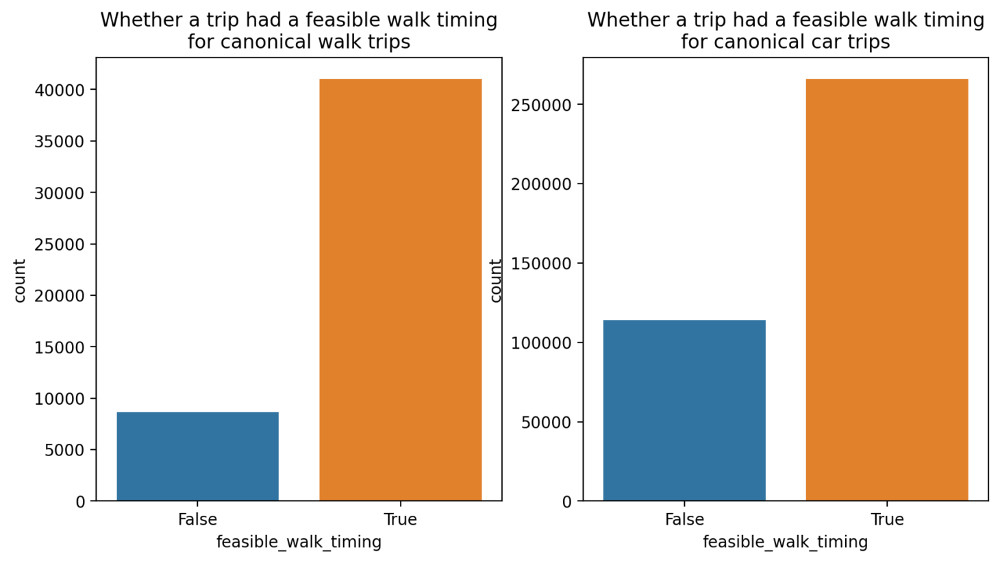

# Transit timing

::: {.vmtprogress}

|             | Walk  | Bike | Transit |
|-------------|-------|------|---------|
| % of trips  | 17    | 46    | 45     |
| % of VMT    |  2    | 22    |  35    |

:::

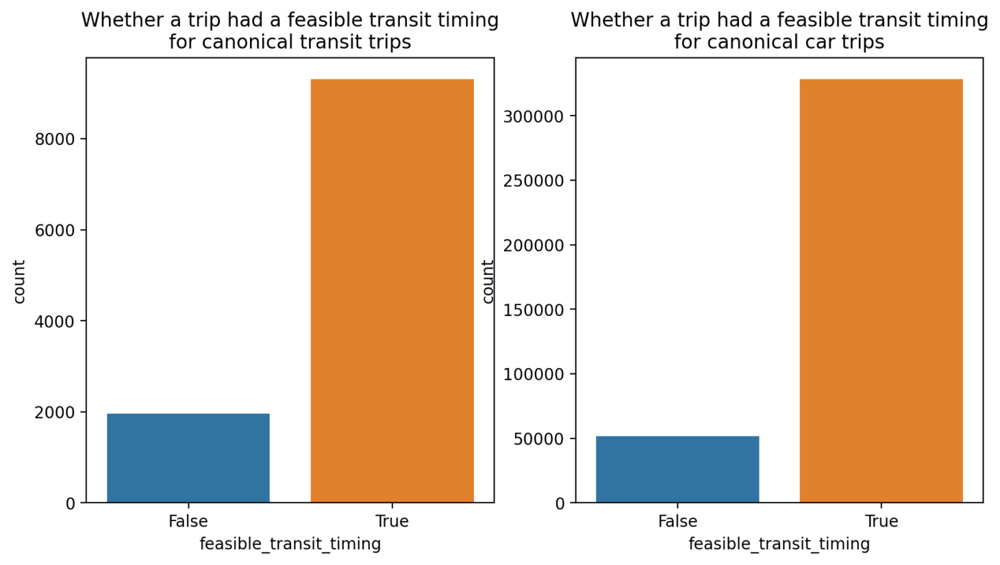

# Bike timing

::: {.vmtprogress}

|             | Walk  | Bike | Transit |
|-------------|-------|------|---------|
| % of trips  | 17    | 34    | 45     |
| % of VMT    |  2    | 16    |  35    |

:::

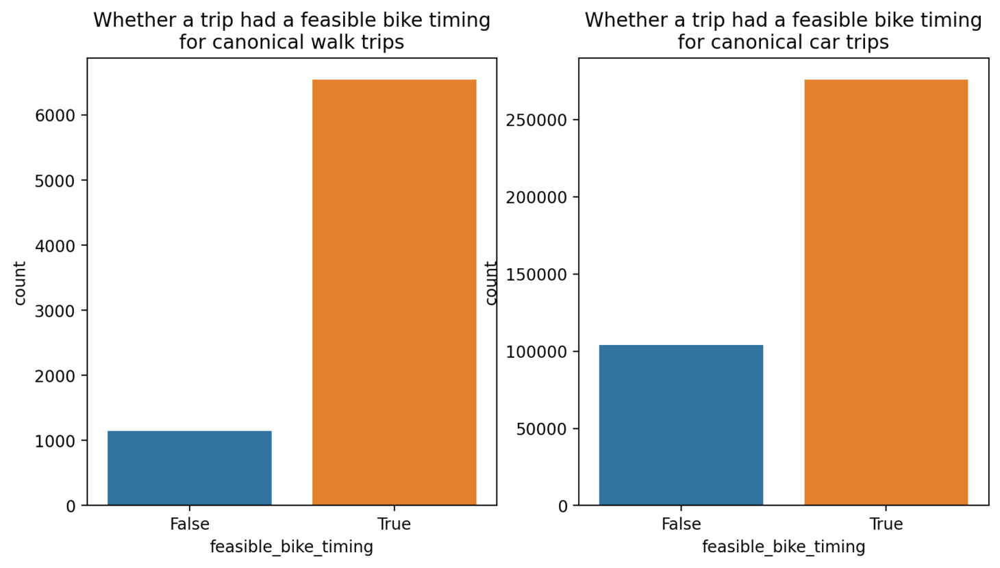

# Results

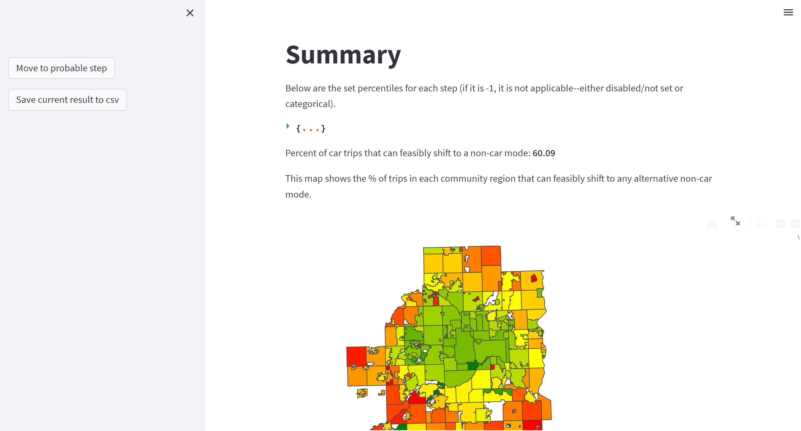

::: {.vmtprogress}

|             | Walk  | Bike | Transit | Overall |
|-------------|-------|------|---------|---------|
| % of trips  | 17    | 34    | 45     | 60      |
| % of VMT    |  2    | 16    |  35    | 40      |

:::

# Results: where can trips shift?

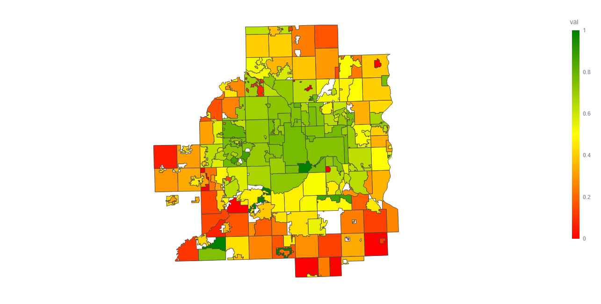

# Results: who can shift trips?

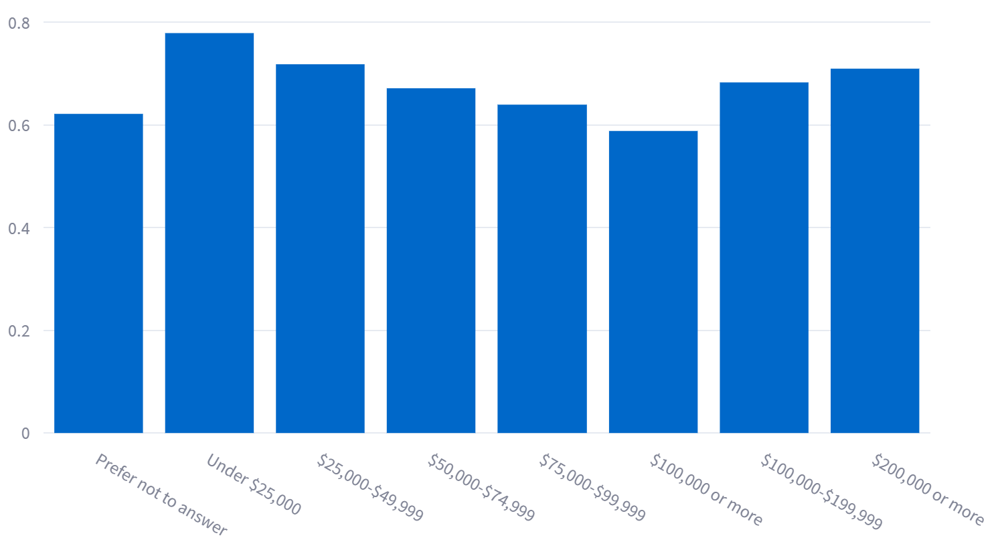

# Results: who can shift trips?

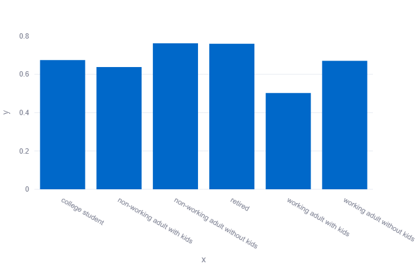

# Feasibility vs likelihood

- Just because it is _possible_ to shift a trip doesn't mean it is _probable_
- For instance, transit trips that take hours longer than car trips
- An additional set of steps estimates this probable shift

# Relative duration

::: {.vmtprogress}

|             | Walk  | Bike | Transit |
|-------------|-------|------|---------|
| % of trips  | 11     | 20    | 18     |
| % of VMT    |  1    | 4    |  6    |

:::

- What happens if we only consider trips where the alternative is less than 15 minutes longer?

# Bike absolute LTS distance

::: {.vmtprogress}

|             | Walk  | Bike | Transit |
|-------------|-------|------|---------|
| % of trips  | 11     | 4    | 18     |
| % of VMT    |  1    | 1    |  6    |

:::

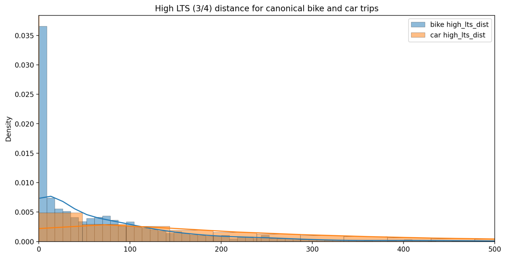

# Trip purposes

::: {.vmtprogress}

|             | Walk  | Bike | Transit |
|-------------|-------|------|---------|
| % of trips  | 8     | 3    | 14     |
| % of VMT    |  1    | 1    |  5    |

:::

- Shopping and escort trips are facilitated by cars
- We assume any of these trips will not switch

# Results

- 18% of car trips have a likely shift to another mode
  - 5% of VMT
- The "probable" analysis is much more restrictive than the "feasible" analysis

# Next steps

- Tour-level analysis
- Scenarios
- Additional constraints:
  - Number of transfers
  - Temperature and active precipitation

# Conclusions

- Interactive visualizations can illuminate assumptions and sensitivity
- There may be significant mode shift potential in the Twin Cities
- That potential is concentrated in central areas

# Questions/contact

Matt Bhagat-Conway 
[mwbc@unc.edu](mailto:mwbc@unc.edu)

Greg Erhardt 
[greg.erhardt@uky.edu](mailto:greg.erhardt@uky.edu)

# References

::: {#refs}
:::

# Biking in the snow

::: {.vmtprogress}

|             | Walk  | Bike | Transit |
|-------------|-------|------|---------|
| % of trips  | 25    | 72    | 59     |
| % of VMT    |  3    | 32    |  46    |

:::

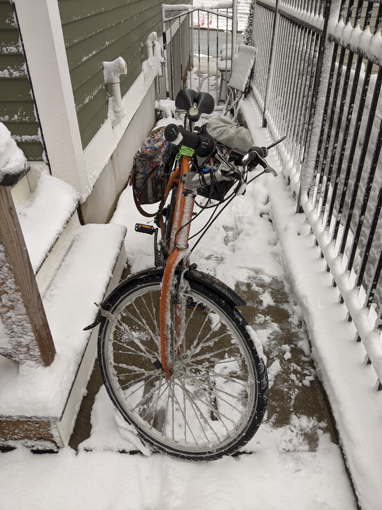

# Biking in the snow

::: {.vmtprogress}

|             | Walk  | Bike | Transit |
|-------------|-------|------|---------|
| % of trips  | 25    | 54    | 59     |
| % of VMT    |  3    | 24    |  46    |

:::

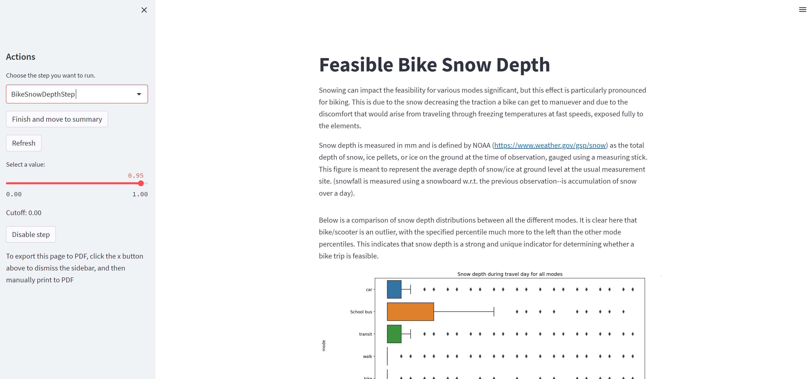

# People really don't like biking in the snow

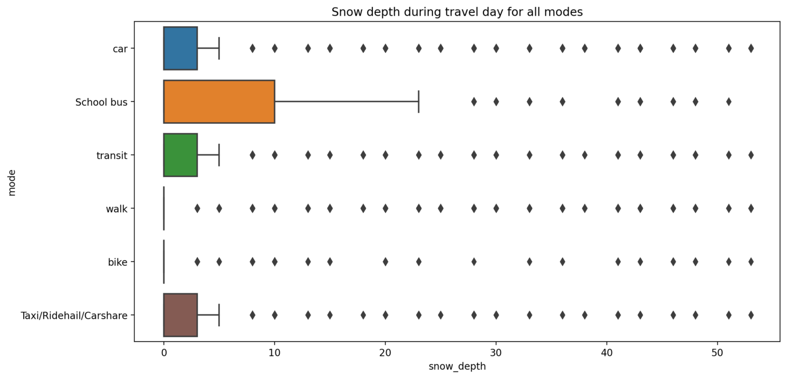

# Level of Traffic Stress

::: {.vmtprogress}

|             | Walk  | Bike | Transit |
|-------------|-------|------|---------|
| % of trips  | 25    | 46    | 59     |
| % of VMT    |  3    | 22    |  46    |

:::

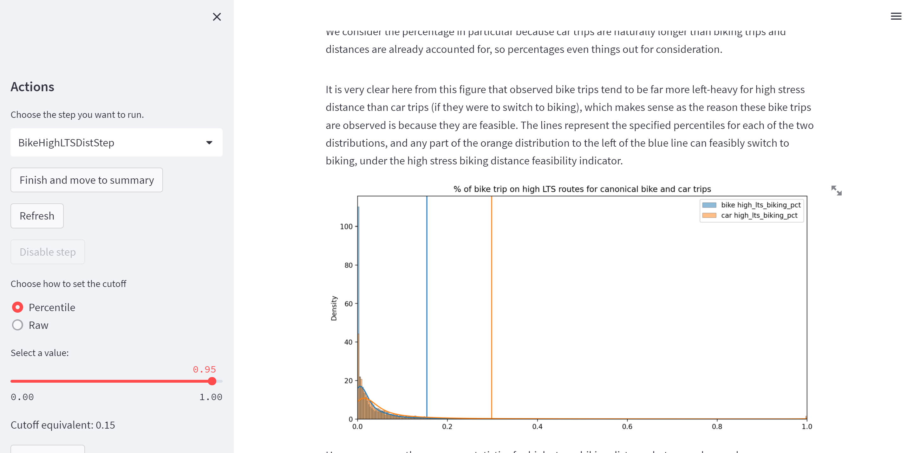

# Level of Traffic Stress

::: {.vmtprogress}

|             | Walk  | Bike | Transit |
|-------------|-------|------|---------|
| % of trips  | 25    | 46    | 59     |
| % of VMT    |  3    | 22    |  46    |

:::

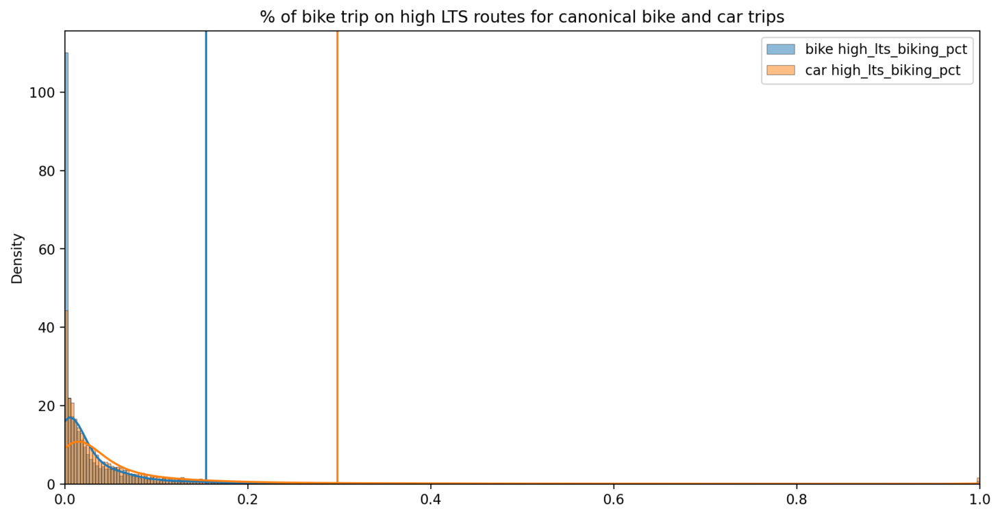

# Level of Traffic Stress

::: {.vmtprogress}

|             | Walk  | Bike | Transit |
|-------------|-------|------|---------|
| % of trips  | 25    | 46    | 59     |
| % of VMT    |  3    | 22    |  46    |

:::

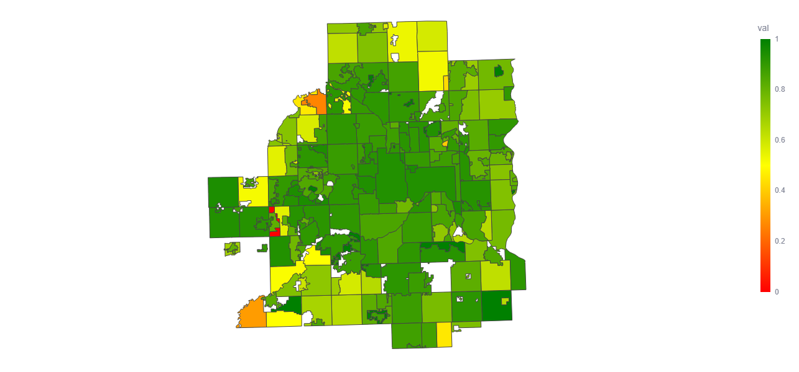

# Transit

::: {.vmtprogress}

|             | Walk  | Bike | Transit |
|-------------|-------|------|---------|
| % of trips  | 25    | 72    | 59     |
| % of VMT    |  3    | 32    |  46    |

:::

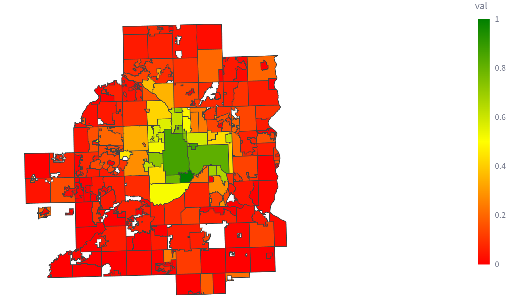

# Results: who can shift trips?

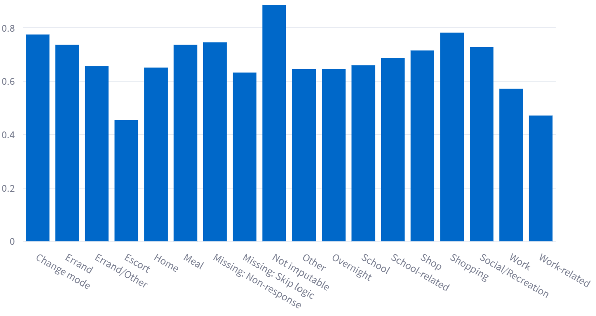

# Results: who can shift trips?

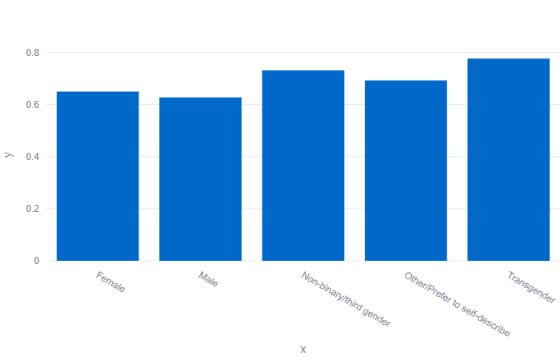

# Walk duration

::: {.vmtprogress}

|             | Walk  | Bike | Transit |
|-------------|-------|------|---------|
| % of trips  | 3     | 34    | 45     |
| % of VMT    |  0    | 16    |  35    |

:::

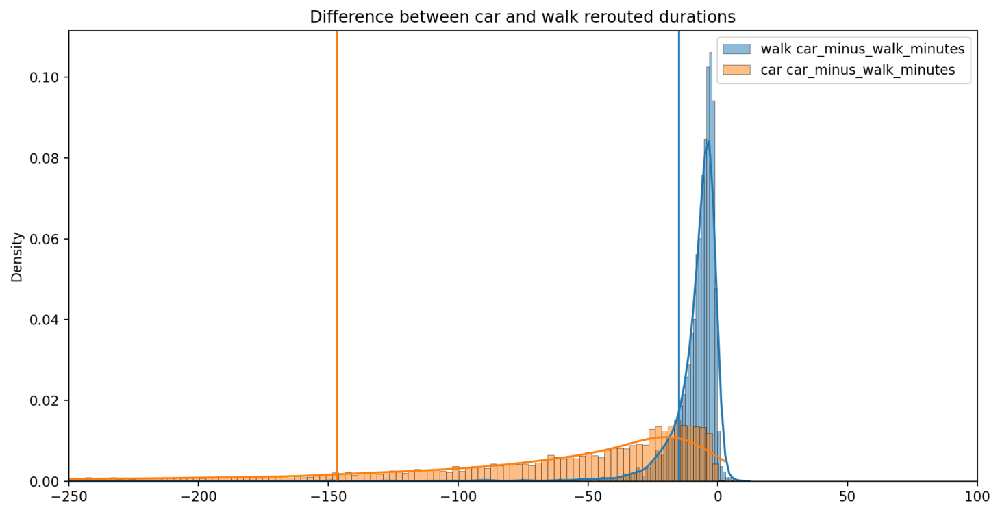

# Bike duration

::: {.vmtprogress}

|             | Walk  | Bike | Transit |
|-------------|-------|------|---------|
| % of trips  | 3     | 12    | 45     |
| % of VMT    |  0    | 1    |  35    |

:::

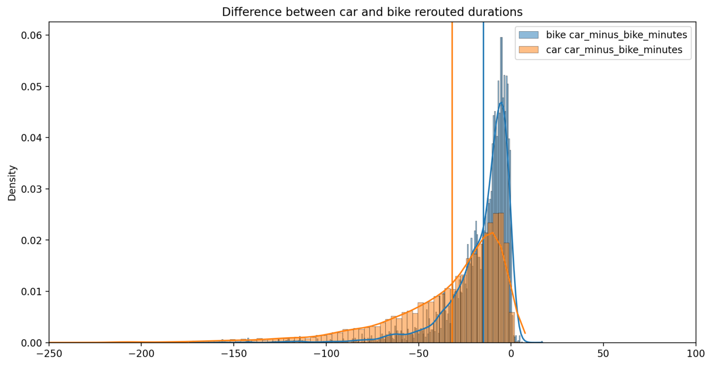

# Transit duration

::: {.vmtprogress}

|             | Walk  | Bike | Transit |
|-------------|-------|------|---------|
| % of trips  | 3     | 12    | 12     |
| % of VMT    |  0    | 1    |  5    |

:::

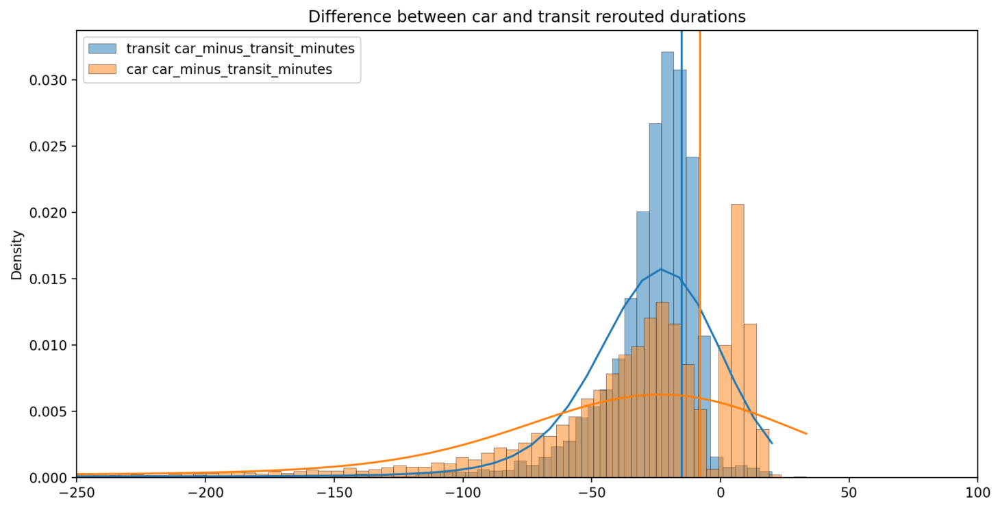