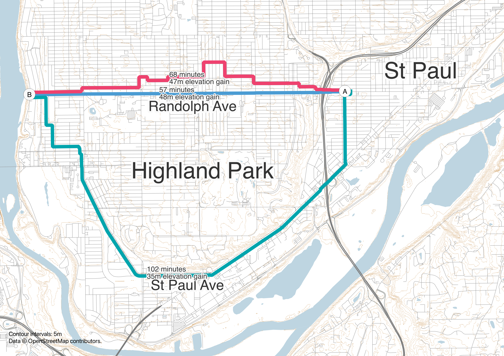
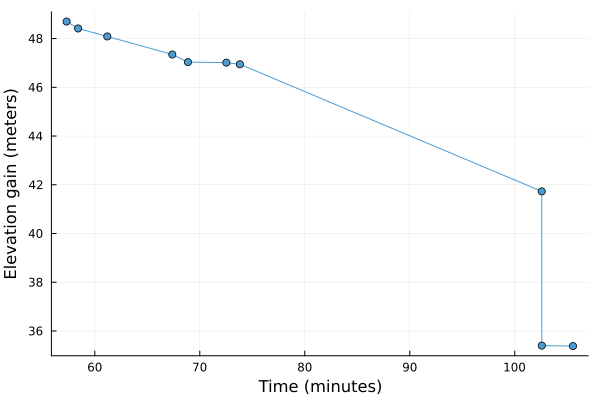
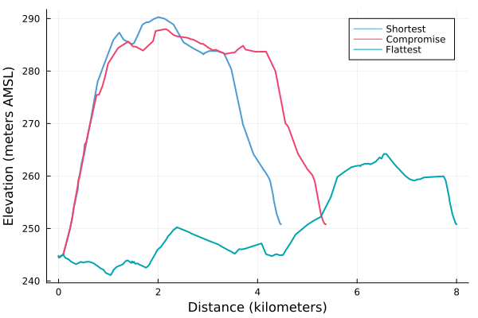

# Single-objective shortest path algorithms

- Finds a path through a (street) network
- Uses _costs_ or _weights_ for street segments
    - Could be travel time, travel distance, etc.
- Finds path that has lowest total cost/weight

# Behavioral realism

- Humans consider many things beyond distance/travel time when choosing routes
    - Slope
    - Safety
    - Travel time uncertainty
    - Familiarity
    - Scenery
    - etc.

# Generalized costs

- It is possible to include multiple cost measures in a single-objective algorithm through a _generalized cost_
- This is a weighted sum of cost components
- For instance, travel time plus 0.5 times elevation gain

# Imposing limits with generalized costs

::: {.incremental}
::: {.nonincremental}
- We may want to impose a maximum distance or travel time
    - For instance, people won't walk more than 5 km or one hour
:::
- We can only guarantee we find all feasible paths when limits are in the same units as cost (e.g. generalized cost)
- Otherwise, we aren't guaranteed to find a path less than the limit, even if one exists
:::

# 

::: {.fullimg}

:::

# What if...

- we just impose limits with generalized costs anyways? 🤷‍♂️
    - We're effectively saying that people will always use the generalized path over a shorter path
    - Trips where this makes the trip too long are infeasible
- we _don't_ impose limits with generalized costs?
    - Paths for trips near the limit will effectively underweight other attributes

# One alternative: travel time

- Some things can be expressed in terms of time
    - e.g. people walk slower up slopes
- If all cost components can be expressed in terms of time, time cutoffs can be used
- Cannot include costs that do not affect travel time
    - e.g. safety
- Cannot include costs over and above effect on travel time
    - e.g. avoidance of slopes even if it means a longer walk

# Removing links from the network

- Removing links from the network altogether does not cause any issues
- Safety could be addressed by removing unsafe links

# Multiobjective routing algorithms

- Multi-objective routing algorithms find shortest paths for multiple costs simultaneously
- They find all paths where there is not another path that has a lower cost for one cost without having a higher cost for another
    - i.e. all possible tradeoffs

# Multiobjective routing results

::: {.fullimg}

:::

# Multiobjective routing results

::: {.fullimg}

:::

# 

::: {.fullimg}

:::

# Advantages of multiobjective routing

- Can impose limits on any cost used in routing
- Can evaluate tradeoffs between different costs (e.g. between distance and elevation)

# Disadvantages of multiobjective routing

- Limited software support/custom development may be required
- More computationally intensive
- More difficult to analyze
    - Multiple paths per trip

# Multiobjective routing and transit

- Transit departure times are effectively a limit on the access path to transit
- Common transit routing algorithms consider time and number of transfers as objectives
- Including other objectives is possible, but requires custom development
    - Bus vs rail
- Using multiobjective street routing for access to transit requires using a multiobjective transit routing algorithm as well

# My recommendations, by mode

- Car: single objective, travel time
- Walk/bike/e-bike: probably generalized cost with distance limit, _maybe_ multiobjective
- Transit: multiobjective time and transfers, _maybe_ mode
