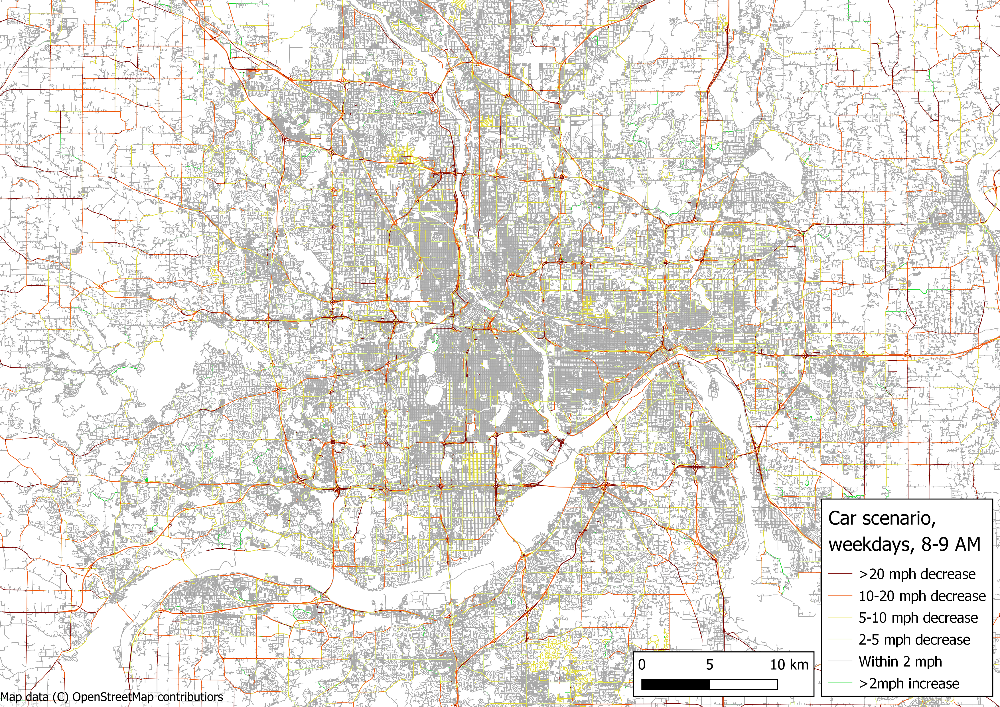
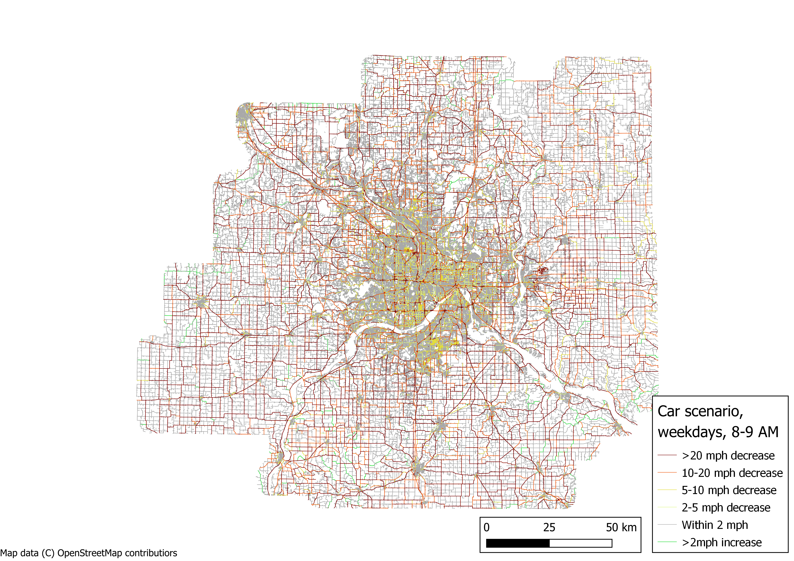

## Setting up the environment

The routing scripts use [OSRM](https://github.com/Project-OSRM/osrm-backend), accessed using the [OSRM.jl](https://github.com/mattwigway/OSRM.jl) Julia package, for street routing. [TransitRouter.jl](https://github.com/mattwigway/TransitRouter.jl) is used for transit routing. OSRM is written in C++ and requires numerous headers, compilers, and libraries to be installed. In particular, installing on Windows is difficult. The easiest way to get everything running is by using a Docker/Podman image (described in the next section). If you would prefer to install OSRM locally, instructions to do so are in the section after that.

### Using the Docker/Podman image (recommended)

_Note: I use [Podman](https://podman.io/) to build and run the image due to more permissive licensing. All of the steps below should work with Docker as well, by simply replacing `podman` with `docker`_

#### Setting up the podman VM

If you have not used podman in the past, you need to run

`podman machine init`

to set up the Podman virtualization layer. Furthermore, on Mac, you will need to Run

`podman machine set --cpus 8 --memory 8192`

to maximize performance. Adjust the number of CPUs and memory allocated to the container as needed.

On both Windows and Mac, you can then run 

`podman machine start`

to start Podman.

#### Building the image

The first step is to build the container image. Due to the specialized nature of the image and the desire to avoid paid services, the image is not deployed to a container registry but must be built on each machine used. However, the containerization framework means that this build process should be successful regardless of underlying operating system, etc. The only prerequisite to this step is that Podman already be installed.

To build the image, open a console (a shell on Linux/Mac, PowerShell on Windows) and change the working directory to the `src/routing` directory of this repository. Run the following command:

`podman build . -t vmt-routing`

This will build the container described by the `Dockerfile` in the current directory, and tag it locally as `vmt-routing` to make it easier to refer to it later. This step will take several minutes, as dependencies are installed, OSRM is downloaded from Github and compiled, and the Julia environment is set up.

The container is based on Julia 1.9.4; the Julia version can be upgraded by changing the first non-commented line of the file. Julia versions are intended to be backwards compatible, and in my experience this is generally true. Updating to a more recent 1.x.x version of Julia is likely to work just fine.

OSRM is currently built off [this branch](https://github.com/mattwigway/osrm-backend/tree/process-segment-flags) which includes some features we added to support this project. Once [this pull request](https://github.com/Project-OSRM/osrm-backend/pull/6658) is merged into OSRM, we can build off the OSRM master branch. There is a line in the `Dockerfile` that uses `curl` to download the zipped source code; this can be changed to refer to the master branch of OSRM at that time.

#### Creating a volume

The podman image does not include the git repository or any of the TBI data. There are several reasons for this. The git repository is likely to change regularly, and keeping it outside the image means we don't need to rebuild the image every time the code in the git repository changes (only if OSRM, OSRM.jl, or TransitRouter.jl versions change). Keeping the git repository outside the image allows using any tools (editors, etc) you have installed on your system to edit the code, without needing them to be installed inside the image, and allows you to commit and push changes to the code without putting your git credentials in the image. Lastly, if we ever did push the image to a repository, we do not run the risk of sharing TBI data with people who should not have access to it.

Instead, we _bind mount_ the git repository and the directory with the TBI data to the image when we run it. This way, we can access the files stored on the host computer at runtime, without them being included in the image.

_Bind mounts_ are not very performant. For the code and most of the input data, this does not matter; the files are small enough that performance is a non-issue. However, for the OSM and StreetLight data, OSRM network files, and the output data, performance _does_ matter significantly. To store these, I recommend creating a podman _volume_; this is persistent performant storage that you can attach to a container at runtime. To create this volume, run

`podman volume create vmt-local`

At this point, you are ready to run the software. The steps above only need to be done once, unless you wish to upgrade versions of underlying software or move to a new computer.

#### Starting the image

To start the image and get to a command line with the necessary software installed, run:

```bash
podman run --rm -it
    --mount "type=bind,source=path/to/vmt-mode-shift-study,target=/home/vmt/code" 
    --mount "type=bind,source=path/to/VMT Reduction Mode Shift - General,target=/home/vmt/data" 
    --mount "type=volume,source=vmt-local,target=/home/vmt/local,chown=true"
    --userns=keep-id
    vmt-routing
```

changing the paths in the first two `--mount` options to the path to your git repository and shared folder with data. Note, you will need to put the entire command one one line (Windows) or put a `\` at the end of each line (Mac).

After running this, you should see a command prompt that looks lilke this (the letters and numbers after the `@` are the ID of the running container, and will change each time you start the container):

`vmt@8c7690633035:~$`

This is a `bash` prompt in the environment, with all of the requisite software installed. The git repository is available at `~/code`, the data at `~/data`, and the `vmt-local` volume at `~/local`.

### Building locally (advanced)

If you do not want to use the podman image, you can install the dependencies locally. First, you need to have OSRM built and installed (see instructions [on the OSRM github](https://github.com/Project-OSRM/osrm-backend#building-from-source)). I  have had no luck installing OSRM on Windows; if you're using Windows, consider using Windows Subsystem for Linux (WSL) for routing. For now, you should install from the `process-segment-flags` branch of `mattwigway/osrm-backend`, but the changes in that branch currently have a pull request to be incorporated back into the main OSRM repository.

Then, you need to install the C++ shim library to allow Julia to communicate with OSRM. To do that, clone the [OSRM.jl](https://github.com/mattwigway/OSRM.jl) Github repository, and within the `cxx/build` directory, run:

    cmake ..
    cmake --build .
    sudo cmake --build . --target install

The difficult part is now over; you just need to install the Julia packages needed for routing. This can be done by running `julia --project` in this directory, and then typing `]instantiate` to install the dependencies.

## Street routing

OSRM requires the original `analysis-area.osm.pbf` to be processed into a network, using a "profile" that assigns weights based on mode. We use custom profiles for all routing, to account for safety, congestion, etc. The profiles are in the `src/routing/profiles` directory, and the source OSM data is in the shared folder under `2-Re-Routing Analysis/OSM/analysis-area.osm.pbf`. For performance, I recommend copying the OSM data to `~/local` in the Podman image. I do _not_ recommend copying the profiles; by leaving them in the repository we ensure any changes are picked up, and they are small enough that read performance does not matter.

For all of the following steps, if you built the code locally instead of using podman, you will need to set the environment variable `JULIA_PROJECT=path/to/src/routing/`. This is because in the podman container the dependencies are installed in the global environment (since the container is single-purpose, there is no need for multiple Julia environments). When running locally, you may have multiple julia environments for different projects. This is not necessary when running in podman.

I recommend storing the networks in `~/local/networks` - go ahead and create that directory. The commands below assume your working directory is `~/code/src/routing`

For replicability, there are short shell scripts to build and route each network/scenario. These make sure that the exact options and files used are consistent, and take only the directory names where data is stored and output should be placed. This ensures we always use the same files and networks for the same outputs. The build scripts all call `build_street_network.sh` which in turn calls OSRM to build the street networks. The routing scripts all call `route.jl` which does the actual routing.

### Auto routing

#### Baseline

Auto routing is different from the other street routing modes because it is time dependent (due to congestion).

Because the routing is very fast, we simply build separate networks for each congestion period from StreetLight, and route all trips on all networks.

The `car_traffic` profile expects two environment variables to be set, `SPEED_DATABASE` and `SPEED_COLUMN`, referring to the SQLite database and the column to retrieve speeds from. This will be very slow without the proper indices; create them by running `sqlite3 path/to/speed_database.db < prepare_speed_database.sql`. This is already done in the database available in `2-Re-Routing Analysis/Congestion`, which I recommend copying to `~/local` if using podman.

The bash script `build_car_baseline_networks.sh` will build all of the car networks in sequence. It requires the `SPEED_DATABASE` environment variable to be set, and will populate `SPEED_COLUMN` automatically. These environment variables are used by the car traffic profile to select the time period to grab traffic data for.

Use the following command to build the car traffic networks.

    SPEED_DATABASE=~/local/streetlight_data.db bash build_car_baseline_networks.sh ~/local/analysis-area.osm.pbf ~/local/networks/

This will create a bunch of networks called `car_<period>` in `~/local/networks` - one for each time period.

Likewise, we must do the routing for each of the car networks. The bash script `route_car_baseline.sh` will do this.

    bash route_car_baseline.sh ~/data/Data_Processed/ ~/local/networks/ ~/local/output

This will create files containing every trip routed for each time period in `~/local/output`, tagged with the most recent git commit hash to avoid version confusion (though if you have local modifications you have not yet committed, that may still cause some confusion). These can then be copied to `~/data/Data_Processed/geodata` for further analysis outside the podman container. I recommend keeping the output inside the Podman volume and moving/copying it out, rather than writing directly to the shared folder, for several reasons. This prevents overwriting previous results if a routing run fails, 

There is a Jupyter notebook that can then be used to combine these files into a single file containing the record for each car trip at the time it was observed. The output of OSRM does not contain any terminal time; adding terminal time is necessary for the OSRM results to approximate the TBI results (and is a better reflection of the real world as well).

#### Speed cap scenario

In the car speed scenario, we cap StreetLight speeds with [NACTO recommendations](https://nacto.org/publication/city-limits/the-right-speed-limits/). The recommendations require some speed studies, so we simplify further, using the speeds in @tab-speeds. Since these are maximum speeds, we multiply by 0.8 to approximate an average speed; this is the same multiplication factor used by OSRM out of the box to scale OSM-provided maximum speeds.

|                     | Urban    | Suburban | Rural |
|---------------------|----------|----------|-------|
| Shared street/alley | 10 mph   |  10      | 10    |
| Minor streets       | 20       |  20      | 20    |
| Major streets       | 25       |  35      | 35    |
| Freeways            | 55       |  55      | 65    |

: Speeds for different road types in different environments {#tab-speeds}

We map OpenStreetMap `highway` tags to street types using the `src/routing/car_speed_scenario/highway_types.csv` file; the template for this file (listing all highway tags) is generated by the Julia script `extract_highway_tags.jl`. This maps each highway tag to a street type. The Urban/Suburban/Rural designation is created based on the Minneapolis 2040 neighborhood types provided, and mapped as follows:

- Urban: Urban, Urban Center
- Suburban: Suburban, Suburban Edge, Emerging Suburban Edge
- Rural: Agricultural, Diversified Rural, Non-Council Area, Rural Center, Rural Residential and areas beyond the Minneapolis 2040 polygons

The first step is to create an SQLite database that has the speed cap for every way ID in the OSM file. This database is used by the OSRM profile to set speed caps. 

The speed cap scenario requires a database by way of speed caps. This can be created using the `car_speed_scenario/area_for_way.jl` script, which reads the OSM file, matches it with the tags in the `car_speed_scenario/highway_types.csv` file, and creates an SQLite database with the speed cap for each way:

    julia car_speed_scenario/area_for_way.jl ~/local/analysis-area.osm.pbf ~/data/Data/GIS/fgdb_society_thrive_msp2040_com_des.gpkg ~/local/speed_cap_database.db

The networks can then be built by running the code below. This will create one network for each StreetLight time period.

    SPEED_DATABASE=~/local/streetlight_data.db bash build_car_speed_scenario_networks.sh ~/local/analysis-area.osm.pbf ~/local/networks/ ~/local/speed_cap_database.db

Then the routing can be run by running

    bash route_car_speed_scenario.sh ~/data/Data_Processed/ ~/local/networks/ ~/local/output

This will create files containing every trip routed for each time period in `~/local/output`. These can then be copied to `~/data/Data_Processed/geodata` for further analysis outside the podman container. There is a Jupyter notebook that can then be used to combine these files into a single file containing the car trip at the time it was observed.

The speed scenario significantly reduces speeds on major arterials throughout the region, as shown in @fig-speed-central and @fig-speed-regional. A small number of roads show increased speed, because NACTO guidelines are actually higher than the OSRM defaults for a few types of roads; they are a small enough part of the network this is not expected to materially influence results. Note that the significant reductions on large interchanges are because motorway links are designated as "major" roads rather than freeways, because they often serve as the transition between freeways and major roads. This does mean that freeway-to-freeway interchanges may have lower-than-expected speeds, but they also make up a small portion of any trip.

<!-- these maps were created in QGIS, using the QGIS project file in the 2-Re-Routing Analysis/Networks directory -->

{#fig-speed-central fig-alt="Map showing how much speed was reduced by the speed scenario, weekdays, 8-9 AM. There were significant reductions on arterials and freeways. Local streets mostly stay about the same. A small number of roads show increases."}

{#fig-speed-regional fig-alt="Map showing how much speed was reduced by the speed scenario across the region, weekdays, 8-9 AM. The grid of rural highways show significant reductions in speed."}

### Walking and bicycle routing {#sec-walkbike}

The walk profile is based primarily on travel time and safety. @hardy_accessibility_2019 develop a set of equivalent speeds to adjust the value of pedestrian infrastructure based on quality, shown in @tab-pedspeed. We use these penalties to adjust the routing _weights_ but not the speeds, as people don't actually walk slower on poorer facilities (likely the opposite). We find the minimum weight path based on these weights, but still calculate speed without regard to roadway quality.

| Functional class         | Lanes | Has sidewalk | Vehicle speed | Pedestrian speed | Weight penalty |
|--------------------------|-------|--------------|---------------|------------------|----------------|
| Any                      | Any   | Yes          | > 55 mph      | 1.5 mph          | 2              |
| Any                      | 6+    | Yes          | <= 55 mph     | 2.4 mph          | 1.25           |
| Freeway/major highway    | 4--5  | Yes          | <= 55 mph     | 2.4 mph          | 1.25           |
| Major arterial           | 4--5  | Yes          | <= 55 mph     | 2.4 mph          | 1.25           |
| Minor arterial/collector | 4--5  | Yes          | 41-55 mph     | 2.4 mph          | 1.25           |
| Minor arterial/collector | 4--5  | Yes          | <= 40 mph     | 2.7 mph          | 1.11           |
| Local                    | 4--5  | Yes          | 41-55 mph     | 2.4 mph          | 1.25           |
| Local                    | 4--5  | Yes          | 31-40 mph     | 2.7 mph          | 1.11           |
| Local                    | 4--5  | Yes          | <= 30 mph     | 3.0 mph          | 1
| Freeway/major highway    | <= 3  | Yes          | <= 55 mph     | 2.4 mph          | 1.25           |
| Major arterial           | <= 3  | Yes          | 31-55 mph     | 2.4 mph          | 1.25           |
| Major arterial           | <= 3  | Yes          | <= 30 mph     | 2.7 mph          | 1.11           |
| Minor arterial/collector | <= 3  | Yes          | 41-55 mph     | 2.4 mph          | 1.25           |
| Minor arterial/collector | <= 3  | Yes          | <= 40 mph     | 2.7 mph          | 1.11           |
| Local                    | <= 3  | Yes          | 41-55 mph     | 2.4 mph          | 1.25           |
| Local                    | <= 3  | Yes          | 31-40 mph     | 2.7 mph          | 1.11           |
| Local                    | <= 3  | Yes          | <= 30 mph     | 3.0 mph          | 1
| Any                      | 4+    | No/Unknown   | Any           | 1.5 mph          | 2              |
| Any                      | <= 3  | No/Unknown   | > 30 mph      | 1.5 mph          | 2              |
| Freeway/major highway    | <= 3  | No/Unknown   | <= 30 mph     | 1.5 mph          | 2              |
| Major arterial           | <= 3  | No/Unknown   | <= 30 mph     | 2.4 mph          | 1.25           |
| Minor arterial/collector | <= 3  | No/Unknown   | <= 30 mph     | 2.4 mph          | 1.25           |
| Local                    | <= 3  | No/Unknown   | <= 30 mph     | 2.4 mph          | 1.25           |
| Off-street               | N/A   | N/A          | N/A           | 3.0 mph          | 1              |

: Speed and weight adjustments for varying quality of pedestrian facilities [@hardy_accessibility_2019] {#tab-pedspeed}

#### Elevation data {#sec-elevation}

For bicycling and walking, routing accounts for elevation differences. In order to do this properly, we need elevation data. We use 1/3 arc-second (~10m) resolution data from the USGS 3D Elevation Program. OSRM will interpolate between the points in the raster, so the resolution is not quite as bad as it sounds. We have also set our OSRM profiles up to assume that bridges and tunnels are level (due to technical limitations, we treat them as level even if the endpoints are not at the same elevation). The processed elevation data is available in our shared folder, under `2-Re-Routing Analysis/Elevation`. You can copy the `final.asc` file on your podman local drive. If you want to download new elevation data, follow the steps below; otherwise just use that file.

The script `download_elevation_data.jl` will download all of the GeoTIFF files for the analysis area (each covers one square degree). The script takes one argument, which is the output directory to save the elevation data in. The data requires about 30-35GB of space for all processing to take place.

    julia download_elevation_data.jl path

Once the elevation data files are downloaded, several more steps need to happen. They need to be combined into a single file for the analysis area, they need to be reprojected from NAD83 (used by USGS) to WGS84 (used by OSM/OSRM), and they need to be converted to the text-based grid format OSRM requires. OSRM additionally requires that all raster data be integers, so that needs to be done. To minimize rounding errors, we also convert the elevations to millimeters above mean sea level. The shell script `prepare_elevation_data.sh` handles these steps, with the same path specified in the previous command:

    bash prepare_elevation_data.sh path

Since this is a shell script, it will only run on macOS or Linux; if you are using Windows and not using podman, I recommend installing the Windows Subsystem for Linux. You will need it to run OSRM anyhow. You pass in the path to directory you downloaded the elevation to. This will create three new files: combined.tif, which is a GeoTIFF combining all of the elevation tiles into a single dataset; final.asc, which is the OSRM-format raster grid, and final_header.asc, which contains information about the spatial extent of the file. This spatial extent should match the variables declared at the top of `profiles/elevation.lua`.

#### Building the network

When building the bicycling and walking networks, the path to `final.asc` will need to be specified in the environment variable `ELEVATION_FILE`. Both profiles also refer to the car profile to get information about roads for assessing safety, so `SPEED_DATABASE` must be set as well (and `SPEED_COLUMN`, but that is set automatically in the build scripts). There is a build script for each of the networks: the walk and bike baseline, one walk scenario, one bike scenario (All streets treated as LTS1), and an ebike scenario. The ebike scenario builds off the bike scenario-so not only are all streets treated as LTS1, speeds are 13% faster,[^bikelts] and there is no slope avoidance.

    SPEED_DATABASE=~/local/streetlight_data.db ELEVATION_FILE=~/local/elevation/final.asc bash build_walk_baseline_network.sh ~/local/analysis-area.osm.pbf ~/local/networks/
    SPEED_DATABASE=~/local/streetlight_data.db ELEVATION_FILE=~/local/elevation/final.asc bash build_walk_scenario_network.sh ~/local/analysis-area.osm.pbf ~/local/networks/
    SPEED_DATABASE=~/local/streetlight_data.db ELEVATION_FILE=~/local/elevation/final.asc bash build_bicycle_baseline_network.sh ~/local/analysis-area.osm.pbf ~/local/networks/
    SPEED_DATABASE=~/local/streetlight_data.db ELEVATION_FILE=~/local/elevation/final.asc bash build_bicycle_ebike_network.sh ~/local/analysis-area.osm.pbf ~/local/networks/
    SPEED_DATABASE=~/local/streetlight_data.db ELEVATION_FILE=~/local/elevation/final.asc bash build_bicycle_all_lts1_network.sh ~/local/analysis-area.osm.pbf ~/local/networks/


You will see quite a bit of output warning about streets that are steeper than the [allegedly steepest street in the world](https://en.wikipedia.org/wiki/Baldwin_Street). When a segment is steeper than 35%, we assume it is bad data and set the slope to 0%. Some of these are dirt paths, etc, which may actually be steeper, but may also be artifacts of the low resolution of the elevation data (e.g. due to a saddle point that occurs between two measurements).

There are separate profiles for the walk baseline and walk scenario. The three bicycle networks are all built using the same profile, with different environment variables to control their behavior. These details are handled in each of the build scripts.

[^bikelts]: This estimate of 13% faster is based on several articles. @schleinitz_german_2017 found a mean speed increase of 13.7%; @fishman_ebikes_2016 review articles from China and Prtugal and find increases of 10-15%, and @baptista_onroad_2015 find an increase of 13% in Lisbon.

#### Running the analysis

You can then do the routing for the pedestrian and bicycle networks using the following scripts, which take arguments for the folder where the TBI is stored, where the networks are stored, and where the output should be written.

    bash route_walk_baseline.sh ~/data/Data_Processed/ ~/local/networks/ ~/local/output
    bash route_walk_scenario.sh ~/data/Data_Processed/ ~/local/networks/ ~/local/output
    bash route_bicycle_baseline.sh ~/data/Data_Processed/ ~/local/networks/ ~/local/output
    bash route_bicycle_all_lts.sh ~/data/Data_Processed/ ~/local/networks/ ~/local/output
    bash route_bicycle_ebike.sh ~/data/Data_Processed/ ~/local/networks/ ~/local/output

The output will be stored in a GeoParquet file called `<mode>-<scenario>-<git commit hash>.parquet`, e.g. `walk-baseline-f2802.parquet`. The bike scenarios will also have a GeoParquet file ending in `-segments.parquet` which divides the bike trips up into segments by LTS.

### Converting street networks to GIS format

For debugging and visualization, it's useful to convert the street network to GIS format. The `network_to_gis.jl` script does this. You can run it like this:

    julia network_to_gis.jl ~/local/networks/network_name/network_name.osrm ~/local/networks/network_name.gpkg

This converts the specified network to a GeoPackage file. If you prefer a different format, you can specify `--driver` to indicate what GDAL driver to use for writing the GIS file.

Note that there is not actually a `network_name.osrm` file; this is just the base file name for the many different files that make up an OSRM network (e.g. `network_name.osrm.ebg`, etc.).

There are many networks; the `convert_all_networks_to_gis.sh` script will convert all of them to GIS format so you don't need to run the above command many times. Pass it the path to your networks/ folder and it will convert all found OSRM networks to GIS format.

    bash convert_all_networks_to_gis.sh ~/local/networks

For the car networks, there are quite a few. The `combine_car_networks.jl` script will combine them into a single GIS file to make comparing segment speeds, etc. easier.

    julia combine_car_networks.jl ~/local/networks/car_all.gpkg ~/local/networks/car_*/car_*.gpkg 

The resulting file will have columns for the speed for each of the networks provided on the command line.

## Automated testing of street networks

## Transit routing

For transit routing, we use the [TransitRouter.jl](https://github.com/mattwigway/TransitRouter.jl) package, and 2019 (pre-pandemic) GTFS for Metro Transit and MVTA. 

The transit network is somewhat different than the other networks, in that is is time-dependent (the car networks are not time-dependent, we just use a different network depending on time of day). The differences between access at different times can be stark; leaving one minute later might make you hours later to your destination if your trip involves an infrequent bus. We use the range-RAPTOR algorithm [@delling_roundbased_2015] to find latest-departure-given-earliest-arrival paths. There are often multiple options that arrive at the destination at the same time, because they are different ways to access the same vehicle. The latest-departure-given-earliest-arrival is whichever one departs latest; this is the path we use. This is subject to a few constraints; notably, we require at least 1 minute of waiting for each transfer. Furthermore, if the latest possible departure time is more than two hours after the requested time, it is still guaranteed that we will find an earliest arrival trip, but it is not guaranteed that we will find the one with the latest departure; see @bhagat-conway_earliest_2023 for more information. This also means waiting time at the initial boarding is "compressed" out of the trip. TODO add some information about how this is handled in the analysis step.

We use OSRM and the walking profile described in @sec-walk. This does present an inconsistency, as the walk weighting is based on a generalized cost, but when the transit vehicle comes is based only on clock time. So if you left your home at 8:00, and took a 10-minute safe walk to a bus stop, but the bus left at 8:08, you would miss it. There might have been a five-minute dangerous (or less safe/pleasant) walk avaiable as well, so we would consider the trip impossible even if it were technically not. However, the alternative is that we assume people stop considering safety the closer they get to the transit departure time. While this is probably somewhat behaviorally accurate, since we're looking at mode shift potential and not behavior today, we prefer to treat this trip as inaccessible rather than find the more dangerous path.

For most trips, we route "forward" - that is, we constrain the departure time. For some trips, we route in "reverse," constraining the destination of the trip. This is based on the trip purpose priority, listed below:

1. Medical visit (e.g., doctor, dentist)
1. Errand with appointment (e.g., haircut, accountant)
1. Errand with appointment (e.g., haircut)
1. K-12 school
1. Attend K-12 school
1. Daycare or preschool
1. Attend daycare or preschool
1. College/university
1. Attend college/university
1. Other education-related (e.g., field trip)
1. Attend other education-related activity (e.g., field trip)
1. Attend vocational education class
1. Other type of class (e.g., cooking class)
1. Attend other type of class (e.g., cooking class)
1. Primary workplace
1. Work-related activity (e.g., meeting, delivery, worksite)
1. Went to work-related activity (e.g., meeting, delivery, worksite)
1. Other work-related
1. _All others_

Whichever end has the higher priority is the end that is constrained - so a trip from home to work would be constrained at work, while a trip from a medical visit to work is constrained at the medical visit. Note that pickup and dropoff are not on this list. If it is desired to add them, this can be done by editing the `CONSTRAINED_TRIP_PURPOSE_PECKING_ORDER` variable in `route.jl`.

We assume that even constrained trip purposes have some flexibility. We allow violating the constraint by up to five minutes iff it makes the trip at least 15 minutes better; this is controlled by the variables `HOW_MUCH_A_TRIP_CAN_VIOLATE_REQUESTED_DEPARTURE_ARRIVAL_TIME_WHEN_ALTERNATE_TRIP_ARRIVES_EARLIER_SECONDS` and `HOW_MUCH_EARLIER_TRIP_MUST_ARRIVE_OR_DEPART_TO_VIOLATE_REQUESTED_ARRIVAL_DEPARTURE_TIME_SECONDS` at the top of `route.jl`.

To ensure all trips are routed during the validity period of the GTFS files in use, we change the date of each trip to be the same day of the week, during the week of 2019-10-20. So, for instance, a trip that actually took place on Tuesday, August 6, 2019, will be routed as if it took place on Tuesday, October 22, 2019. This should generally be correct but does not account for special schedules that may be in effect on holidays.

TransitRouter.jl supports overnight routing. For instance, if a trip starts on Tuesday but cannot be completed except by waiting for a vehicle from the Wednesday, we will find the trip using the service on Wednesday. This is most relevant for trips that occur late at night, but applies to all trips---so some trips will have excessive wait times---for instance, a trip leaving Tuesday afternoon, waiting all night, and taking a one-way morning peak bus the next day. In particular, TransitRouter.jl allows transfers between vehicles running on different service days, so will find a trip that takes a bus departing 11:30 PM on Tuesday and transferring to a bus running at 1:00 AM on Wednesday. Transfers can also happen in the other direction; for instance, a trip that starts on a Wednesday bus at 12:30 AM might transfer to the tail end of a run of a bus that started on Tuesday and is thus finishing out the Tuesday service day. This overnight routing feature is not present in most routing software, but is critical for a subset of overnight trips that cross midnight.

The first step to running the transit routing is to build a transit network based on our GTFS, as well as the OSRM walking baseline network (used to calculate transfer times). You can build that network like this:

    bash build_transit_network.sh --osrm-network ~/local/networks/walk-baseline/walk-baseline.osrm -t 2413.5 ~/local/networks/transit.trjl ~/"data/2-Re-Routing Analysis/GTFS/metro_transit_2019-10-16.zip" ~/"data/2-Re-Routing Analysis/GTFS/mvta-transitfeeds_com-20190903.zip"

This creates a transit network in `~/local/networks/transit.trjl` based on 2019 Metro Transit and MVTA GTFS. It uses OSRM to find transfers through the street network based on the walk baseline network created above, with a maximum transfer distance of 2,413.5 m (1.5 miles). During building, you will see several error messages about nonexistent shapes; this is an issue with the GTFS, but it only affects the visualization of routes so can be safely ignored.

To do the routing, you can run

    julia -t auto route.jl ~/data/Data_Processed/tbi_cleaned.csv ~/local/networks/walk-baseline/walk-baseline.osrm ~/local/output/transit.parquet --transit-network ~/local/networks/transit.trjl

The `route.jl` script has a number of options for transit, notably

- `--max-access-distance-meters`, `--max-egress-distance-meters`
    - These control the maximum distance to walk to or from transit (default 2413.5 m)
- `--max-rides`
    - This controls the maximum number of rides (i.e. number of transfers plus one), default 3.

The RAPTOR algorithm output is optimal in terms of travel time. If you want to place a more stringent limit on number of transfers or access/egress distance, you need to re-run the algorithm with those constraints, not simply filter the output. For instance, the fastest trip may require a transfer, but there may be a slower trip that would be found instead if the transfers were limited. Similarly, limiting transfer distance requires rebuilding the network _and_ re-doing the routing.

The output file is still GeoParquet format, but the structure is a bit different. Instead of one record per trip, there is one record per leg, indexed by `trip_id` and ordered by `leg_index`. Instead of durations, date-times for the start and end of each leg are presented.

Transit routing is significantly slower than other modes; expect it to take several hours.

During routing, you will likely see a number of error messages that say something like "Distance returned by distance_matrix (2375) does not match that returned by route (2534.9), for access stop 01499 from origin LatLon(lat=redacted°, lon=redacted°)". This is because a two-stage process is used to create the transit routes. First, nearby stops are found using the OSRM distance matrix function. Then, geometry is found using the OSRM route function. Occasionally, the length of the geometry does not match the distance from the distance matrix. This is related to OSRM internals, and we have not solved it at this juncture, but discrepancies are generally small.

You will also see a few messages that say something like "Trip ID [XX] has no options meeting constraints; requested departure time 2019-10-25T07:23:26, options found departing: 2019-10-25T07:22:04." This indicates that the router was unable to find a trip matching the origin or destination time constraint, but was able to find an option by relaxing that constraint slightly. The difference in times should be no more than five minutes (see above).

### Transit scenario

The transit scenario is that we double frequency on all routes. The GTFS files are coded with actual timetables, not frequency entries, so we need to create new GTFS files with new trips. We do this by duplicating each trip and inserting it halfway between the original trip and the next trip on the route. This means that changes in run time over the course of the day well be reflected in the output. 

More precisely, for each route-direction, we first find the most common stop (i.e. the stop that is served by the most trips on that service day by that route and direction). Generally there will be ties; the one that occurs first in the pattern is used as the "reference stop". Most of the time, this will be a stop that is common to all patterns. The script will warn about the few cases where it is not (why this is important is discussed below).

Then, we identify the first time each trip departs the reference stop, and sort trips by this time. We use the reference stop rather than the time at the first stop, because the first stop may be very different on different trips; if there is a short-turn, for example, a trip that logical person would call "later" may leave the first stop _of that trip_ earlier.

Then, we duplicate each trip and shift it forward in time so that it passes the reference stop half way between the time of the original trip and the next trip on the route-direction. If there is no next trip on the route-direction (i.e. it is the last trip of the day), or if the trip does not pass the reference stop, it is not duplicated but is passed through into the output unmodified.

This process is handled by the script `prepare_transit_scenario.py`, which takes arguments for input and output GTFS. It reads the input GTFS, applies the algorithm, and writes the output GTFS. We applied this script to both the Metro Transit and MVTA GTFS files separately. We then build a new network with the modified GTFS files, and do the transit routing again.
