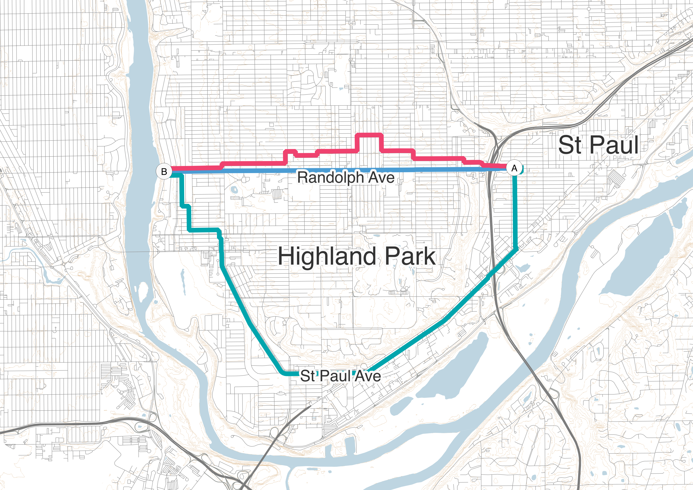
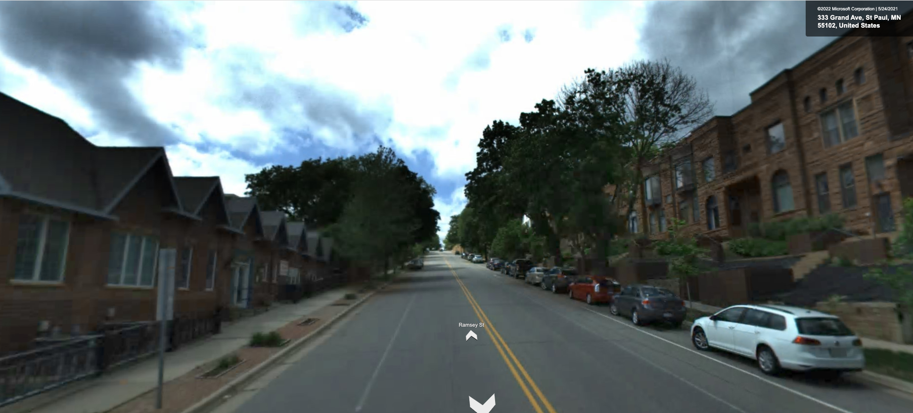

```{python}
import pandas as pd
import json
import numpy as np
import matplotlib.pyplot as plt
```

# Introduction

The goal of the re-routing analysis is to determine the route details for each trip if it had been taken by a different mode—for instance, how long a driving trip would have taken by cycling, or how many transfers would be required if a trip were shifted to transit from another mode. We need to define a “profile” for each alternate mode modeled. These profiles contain the detailed parameters needed to find the paths we have determined to be best. For instance, a walking profile would define how quickly people walk, how far out of their way they will go to travel on a flatter or safer route.

These profiles will be used to determine the weights which will be used in routing. Each street segment is assigned a weight, based on its length, steepness, safety, and anything else the profile deems relevant to route choice. The route that will be found will be the one where the weights of all constituent street segments sum to the lowest amount.

We plan to have four profile for on street modes: driving, walking, bicycling, and e-bicycling (similar to bicycling but with higher speed and reduced/eliminated penalties for hill climbing). We will additionally have a single profile for transit routing.

In addition to weighting, each profile will have rules for selecting which links are preserved. For instance, freeways will be removed from bicycle and pedestrian routing, and footpaths will be removed from automobile routing. Additionally, we may remove certain links from bicycle and pedestrian routing based on level of traffic stress.

This document discusses the components of the weighting and filtering for each of these modes. Some of these may need to be adjusted once software is selected, as some software may not support all of the desired features presented in this document.

# Multiobjective and single-objective routing

A key question that needs to be resolved before routing software can be selected is whether a multi-objective or single-objective routing algorithm is desired. Single-objective algorithms use a single set of weights, and find the lowest cost path as described above. Single-objective optimization algorithms are by far the most common optimization algorithms used in transport. They are simple to implement, computationally efficient, and universally available in network analysis packages.

Multi-objective optimization algorithms, by contrast, find shortest paths using multiple weights, or _objectives_ simultaneously. For instance, @fig-paretomap shows three routes between two points in St. Paul, Minnesota, produced by a multiobjective optimization algorithm, using two weights—one based on travel time, and one based on elevation gain. The algorithm found three paths, unlike the single path found by a single-objective algorithm. One direct path minimizes travel time, while another roundabout path avoids the steep hill between the origin and destination. A third path represents a compromise between the two.

{#fig-paretomap fig-alt="Three Pareto-optimal routes are shown between the east and west sides of Highland Park, St. Paul, Minnesota. One path is direct, but traverses significant terrain. A second is a slight variation on the first, avoiding some of the highest elevations. A third avoids the large hill altogether by taking a significantly longer route around it."}

In more specific terms, a multiobjective routing algorithm finds all _Pareto-optimal_ paths. A path is Pareto-optimal if there is no path that is shorter than it in terms of one objective without also being longer in terms of another. That is, Pareto-optimal paths represent all the possible tradeoffs between the objectives, without including paths that are clearly worse options in terms of multiple objectives. For a more in-depth discussion of Pareto optimality and urban planning, see @conway_pareto_2016.

The tradeoffs between travel time and elevation gain among the three paths are shown in @fig-pareto. This figure represents a "Pareto surface"; anything in the white area above the surface would be suboptimal, as there are other options which are better in terms of _both_ travel time and elevation gain. Anywhere on the line, you cannot improve either elevation gain or travel time without worsening the other. There are no possible paths below the line.

```{python}
#| fig-cap: Travel time and elevation gain for the three paths shown in @fig-paretomap
#| fig-alt: Line plot with three points forming a curve concave to the origin, showing the three tradeoffs between travel time and cost for the paths in the previous figure. Two have lower travel times and relatively high elevation gains, one is much slower and flatter.
#| label: fig-pareto
with open("pareto_demo.geojson") as f:
    raw = json.load(f)

data = pd.DataFrame([{"id": f["id"], **f["properties"]} for f in raw["features"]])
sel = data[data.id.isin([1, 5, 9])]

# make it a step function
xs = sel.time / 60
ys = sel.elev

x2 = np.repeat(xs, 2).iloc[1:]
y2 = np.repeat(ys, 2).iloc[:-1]

plt.fill_between([0, x2.iloc[0], *x2, 200], [0, 0, 0, 0, 0, 0, 0, 0], [100, 100, *y2, y2.iloc[-1]], color="#ccc", zorder=1, lw=0.5)
plt.plot([x2.iloc[0], *x2, 200], [100, *y2, y2.iloc[-1]], color="#444", zorder=1)
plt.scatter(xs, ys, zorder=2, color=["#4B9CD3", "#EF426F", "#00A5AD"])
plt.xlabel("Travel time (minutes)")
plt.ylabel("Elevation gain (meters)")

plt.annotate("Impossible", (70, 40))
plt.annotate("Suboptimal", (80, 48))

plt.ylim(30, 50)
plt.xlim(56, 108)

None
```

Multiobjective routing algorithms allow finding multiple feasible paths between an origin and a destination, based on a variety of criteria. This makes them particularly attractive for active travel research, as people use many factors beyond travel time to choose routes for activate travel. The significant downside, however, to multiobjective routing is that it is considerably more computationally intensive than single-objective routing, and network analysis packages are much less likely to include multiobjective routing algorithms.

A single-objective routing algorithm can incorporate multiple factors through use of a generalized cost or weight (for instance, travel distance in meters plus 0.01 times elevation gain in meters). This would result in finding one of the Pareto-optimal paths above; which one would depend on the relative weights of elevation and distance. This gives some of the advantages of multiobjective routing, without the significant computational burden and limited software support of multiobjective algorithms.

The downside of using a generalized cost comes when you wish to impose limits on the routing, for instance a maximum walking distance of 5 kilometers. A single-objective algorithm will find the shortest path in terms of the generalized cost, which may not be the shortest path in terms of time or distance. If the path with the lowest generalized cost exceeded 5 kilometers, but there was a shorter path that used steeper or less safe streets, a single-objective generalized-cost algorithm would not find it. If we used a 5-kilometer maximum walking distance, we would declare this location inaccessible. When finding access routes for transit, we have the same issue, as the departure time of the transit vehicle is an implicit time limit.

A multi-objective routing algorithm would find both paths, as they are both Pareto-optimal. However, this creates another issue. For nearby destinations, the optimal paths will be based on a combination of multiple factors—distance, slope, safety, and so on. However, as distances approach the cutoff, slope and safety are effectively considered less important, because the longer paths that represent a tradeoff between distance and these other factors will exceed the distance limit and not be found.

# Street routing

We will have four profiles for on-street routing: walking, bicycling, e-bicycling, and driving. We expect to use a common network dataset and routing software for these four modes, with different weights and network filtering rules for each profile. We plan to base the network on OpenStreetMap data from the same vintage as Streetlight Data includes with their congested speeds.

## Walking

The weights used for walking are based first on the walking speed and distance traveled. The typical adult walks between 0.9 and 1.4 meters per second (2.0 to 3.1 mph), with most adults traveling about 1.35 meters per second (3.0 mph) [@bohannon_normal_2011]. Thus, a walking speed of 1.35 meters per second will be used as the basis for pedestrian weights. Future research could investigate varying this walking speed based on respondent characteristics, but that is beyond the scope of this project. It would additionally introduce additional variables into the routing, complicating result interpretation.

### Slope

Another key aspect of the pedestrian environment is slope. Pedestrians avoid steep slopes [@meeder_influence_2017], and walk more slowly when traveling on sloped ground than flat ground [@campbell_using_2019]. @broach_travel_2016 found that pedestrians equate one meter of travel on steep climbs (greater than 10% grade) with roughly two meters of travel on flat ground when choosing routes. A 10% grade is relatively steep; a local example is Ramsey Street between Grand Avenue and Summit Avenue in St. Paul (@fig-ramsey). We found no research providing quantitative estimates of how far pedestrians are willing to walk to avoid less steep slopes.

{#fig-ramsey fig-alt="A steep residential street sloping up from the viewer"}

The resolution of elevation measurement can significantly impact overall slope estimation [@mandelbrot_how_1967]. In general, higher resolution measurement will result in steeper slopes. Over a long street segment, average slope may be moderate, but may be much higher in certain short segments. @broach_travel_2016 measured elevation every 10 meters along each street segment and computed a street-segment-level average. A segment-level average may understate slopes when there is a segment with a steep portion and a flatter portion. That said, since @broach_travel_2016's model was estimated using data derived this way, we propose to estimate average slope in the same way. Then, we can adopt the weights implied by the model in that research, and treat each meter traveled along very steep streets as equivalent to two meters on flatter streets.

@broach_travel_2016 used a 1-meter resolution elevation data. This resolution of data is not widely available, but one-third-arc-second (approximately 10 meter) data is available for the Twin Cities. We do not anticipate this being an issue, as @broach_travel_2016 sampled elevations every 10 meters along each path anyhow.

Bridges can be a challenge, as the elevation data represents the ground level, not the level of the bridge deck. We propose assuming bridges are straight between the elevations of their endpoints. While some bridges have a significant arch to them, we propose this as a reasonable simplification since data is not readily available. If there are specific bridges for which this is an issue, we may be able to manually modify the weights of those bridges to reflect their actual slopes.

### Safety

There are two approaches to handling safety in routing algorithms. One is to to treat unsafe streets as an additional cost---for instance, pedestrians might be willing to travel up to two meters on a safe street to avoid one meter on a dangerous street. The other is to remove streets deemed unsafe from the network; this assumes that the lack of a safe route is a complete barrier to walking. This latter approach has been popularized for bicycling through the Level of Traffic Stress street typology [@furth_network_2016].

Since most travelers have other transport options available (as evidenced by the mode split in the Travel Behavior Inventory), we propose to primarily take the latter approach. Non-captive pedestrians are likely to choose to travel another way rather than travel on an unsafe street when no reasonable alternate routes are available.

The challenge is defining what an unsafe street is. We will remove freeways and other streets where pedestrians are not permitted from the network, of course. Beyond this, authors have taken a variety of approaches to network filtering rules. @hosford_15minute_2022 used no additional filtering for walking, though they did filter out unsafe streets for cycling. In contrast, @owen_access_2015 removed all streets that were not either residential or explicitly marked as allowing pedestrians.

An important aspect of safety is the presence of a sidewalk [@lue_estimating_2019].^[@broach_travel_2016 did not find this factor to be statistically significant, though they believe this to be due to collinearity.] A busy street with a high-quality sidewalk may be relatively comfortable for pedestrians, while a much less busy street with no pedestrian infrastructure may or may not be comfortable. Unfortunately, no comprehensive sidewalk inventory exists in the region, and OpenStreetMap data on sidewalk presence is limited.

Intersections are another major aspect of safety. @broach_travel_2016 found that pedestrians were willing to travel 72 m to avoid an unsignalized crossing of an arterial. Since route choice models don't include people who chose not to walk, the true number may be higher as crossing may discourage someone from taking the trip at all. Most routing tools use a weighting approach to avoiding difficult crossings, but it may be desirable to remove some crossings altogether.

Depending on the software and network data used, weighting or removing crossings may be challenging. Most OpenStreetMap data does not map sidewalks separately from road centerlines, meaning that the routing software does not know which side of the street the pedestrian is on and whether a crossing is necessary. Pedestrian networks including sidewalk and crossing features are preferable, and often yield different results [@zhang_pedestrian_2019]. However, creating such a dataset is non-trivial and beyond the scope of this project. We propose to adopt a weighting approach to crossing safety, as this may slightly overestimate the cost of a trip that passes through an intersection without crossing the street (by turning from one street to another), but will not prevent the trip from being found.

Total traffic volumes are included in some models of pedestrian route choice [@broach_travel_2016; @lue_estimating_2019]. However, total traffic volumes may not reflect the pedestrian environment, as infrastructure can compensate for high traffic volumes, and low-traffic but high-speed roads may feel unsafe.

### Route complexity

Another factor that often enters models is route complexity, with models finding turns to be equivalent to 35–55 meters of travel [@lue_estimating_2019; @broach_travel_2016]. This could easily be included in the routing, if desired.

### Land use

Some authors find land use along the route to be correlated with route choice [@broach_travel_2016; @lue_estimating_2019; @tribby_analyzing_2017]. This is rare in transportation studies, and does not reflect the quality of the transport infrastructure. Thus, we intend to exclude it from this analysis.

### Final weights

The weights we propose are shown in @tbl-walkweight.

| Component | Unit | Weight |
|-----------|------|--------|
| Distance  | meters | $1.35^{-1} \approxeq 0.74$ |
| Distance on steep hills (>10% grade) | meters | 0.74 |
| Unsignalized arterial crossing | each | 53.28 |

: Weight components for walking {#tbl-walkweight}

## Bicycling

## Driving

# Transit

Profiles for transit routing are somewhat more complicated due to the temporal nature of the transit network. Someone who might ordinarily prefer to walk along a longer route using more comfortable streets might instead choose to walk on a busier street if it meant the difference between catching or missing an hourly bus. Similarly, someone who prefers rail might be willing to walk longer and/or have a longer overall travel time to ride rail rather than taking a bus.

Unlike walking, however, it is not correct to assume a generalized cost function for transit routing. As an extreme example, consider the trip to a peak-only express bus with its last run at 9:30 AM shown in Figure 1. In this example, the rider departs home at 9:15 AM, and is faced with two options: a direct but less comfortable route on a major arterial which is a 12 minute walk, and a less direct but more comfortable route along a greenway, which is an 18 minute walk. Even a rider who would normally prefer the greenway (because the safety and comfort benefits are worth more than 6 minutes to them) may choose the route along the major arterial to avoid missing their bus.
